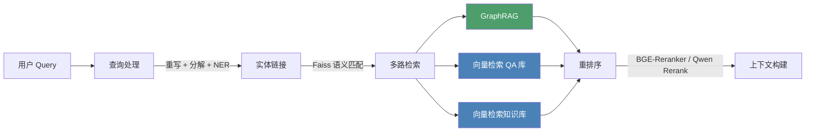
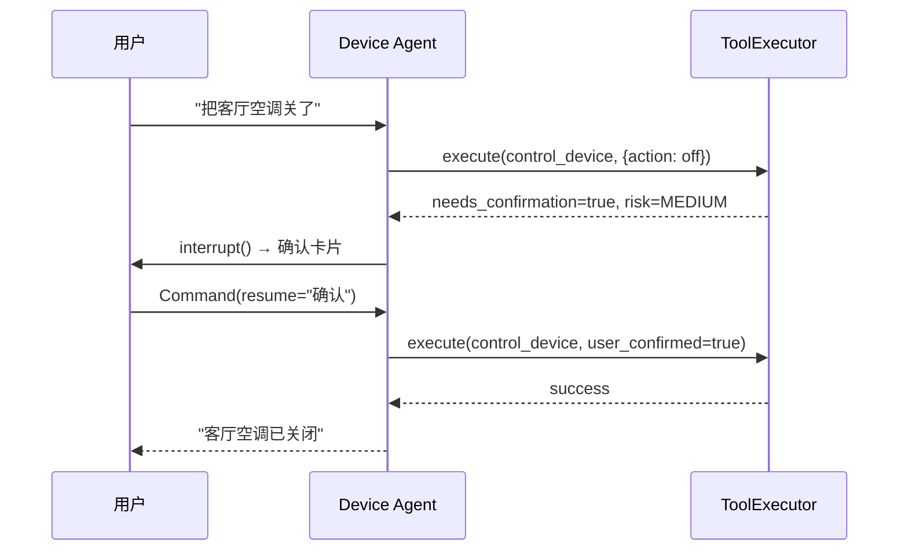

# 银发守护 · Silver Pilot

[](https://www.python.org/)
[](https://www.gnu.org/licenses/gpl-3.0)
[](https://github.com/Tsubaki-01/SilverPilot)
[](https://github.com/Tsubaki-01/SilverPilot)

---

一个面向老年人的医疗健康 RAG + 基于 Supervisor 模式的 multi-Agent 协作系统。前后端均已实现，**开源学习项目**。

系统围绕老年人日常场景设计：医疗用药问答、智能家居控制、情感陪聊、紧急情况响应。后端基于 LangGraph 编排多个专业 Agent，通过 GraphRAG + 向量混合检索获取医学知识；前端提供移动端风格的对话界面，实时展示 Agent 执行过程。

## Features

- **医疗问答** — 基于知识图谱 + 药品说明书的 RAG 检索，回答经幻觉检测校验
- **设备控制** — 自然语言解析为结构化工具调用，带风险评级和 Human-in-the-Loop 确认
- **情感陪聊** — 语音情感识别驱动的情绪感知对话
- **紧急响应** — 识别危险信号后自动安抚 + 通知紧急联系人
- **多模态输入** — 支持文字、语音、图片
- **复合意图** — 单条消息包含多个意图时自动拆解，支持并行分发
- **用户画像** — 从对话中自动提取健康信息（慢性病、过敏、用药），增量持久化
- **对话记忆** — 消息历史超阈值时自动摘要压缩，保持上下文连贯

## Tech Stack


------

## Architecture

### Agent 状态图


Supervisor 通过一次 LLM 调用完成意图分类。单意图串行路由到对应子 Agent，多意图通过 LangGraph `Send` 并行分发。Emergency 意图会短路其他所有意图。

### 节点职责

| 节点                 | 职责                                          |
| -------------------- | --------------------------------------------- |
| Perception Router    | 检测输入模态，调用 ASR / VLM，输出标准化文本  |
| Supervisor           | 意图分类 + 复合意图拆解 + 路由调度 + 循环保护 |
| Medical Agent        | RAG 检索 → 回答生成 → 幻觉自检                |
| Device Agent         | 自然语言 → 结构化工具调用，风险评级 + HITL    |
| Chat Agent           | 情绪感知闲聊，根据 ASR 情感标签调整语气       |
| Emergency Agent      | P0 短路，安抚 + 通知紧急联系人 + 事件记录     |
| Response Synthesizer | 多个子 Agent 回复合成为一条连贯回答           |
| Output Guard         | 敏感内容过滤 + 医疗安全兜底 + 对话摘要压缩    |
| Memory Writer        | 定期从对话提取健康信息，增量写入用户画像      |

### RAG 检索流水线

Medical Agent 内部的检索分五个阶段：




- **社区摘要** — Leiden 算法离线聚类 + LLM 摘要 + 向量化缓存。运行时通过实体命中 + 语义匹配定位相关社区，适合"老年人高血压有哪些治疗方案"这类聚合问题。
- **推理路径** — 在 Neo4j 中查找实体间的多跳最短路径，再由 LLM 翻译为自然语言推理链。比如 `阿司匹林 → 抑制血小板聚集 → 增加出血风险 ← 华法林`，路径本身就是"能不能一起吃"的论据。
- **局部事实** — 传统 1-hop 邻居查询，获取实体的直接属性和关系。

------

## Project Structure

```
src/silver_pilot/
├── agent/                  # Agent 系统
│   ├── bootstrap.py        # 统一启动入口，一次性注入所有依赖
│   ├── graph.py            # LangGraph 状态图拓扑
│   ├── state.py            # AgentState (TypedDict)
│   ├── llm.py              # LLM 统一调用层
│   ├── nodes/              # 各节点实现
│   │   ├── perception_router.py
│   │   ├── supervisor.py
│   │   ├── medical_agent.py
│   │   ├── device_agent.py
│   │   ├── chat_agent.py
│   │   ├── emergency_agent.py
│   │   ├── response_synthesizer.py
│   │   ├── output_guard.py
│   │   ├── memory_writer.py
│   │   └── helpers.py
│   ├── memory/             # 记忆子系统
│   │   ├── summarizer.py   # 对话摘要压缩
│   │   └── user_profile.py # 用户画像 (SQLite + Protocol)
│   └── tools/              # 工具执行引擎
│       ├── schemas.py      # Pydantic Schema + 风险等级
│       └── executor.py     # 校验 → 风险评估 → 执行
│
├── rag/                    # RAG 模块
│   ├── chunker/            # 文档切片
│   │   ├── chunker_base.py
│   │   ├── excel_chunker.py
│   │   ├── markdown_chunker.py
│   │   └── unified_chunker.py
│   ├── ingestor.py         # Chunk → Embedding → Milvus
│   └── retriever/          # 混合检索流水线
│       ├── pipeline.py     # 流水线编排
│       ├── query_processor.py
│       ├── entity_linker.py
│       ├── graph_retriever.py
│       ├── community_builder.py
│       ├── path_reasoner.py
│       ├── vector_retriever.py
│       ├── reranker.py
│       ├── context_builder.py
│       ├── models.py
│       └── graph_models.py
│
├── perception/             # 多模态感知
│   ├── audio.py            # ASR + 情感识别
│   ├── vision.py           # 图像理解 + OCR
│   └── embedder.py         # 文本向量化
│
├── dao/database/           # 数据访问层
│   ├── neo4j_manager.py
│   └── milvus_manager.py
│
├── prompts/                # Prompt 模板管理
│   ├── prompt_manager.py   # Jinja2 + YAML
│   └── templates/
│
├── server/                 # Web 服务
│   ├── app.py              # FastAPI + WebSocket
│   ├── models.py
│   ├── redis_store.py
│   └── session_store.py
│
├── tools/document/         # 文档处理工具
│   ├── converter/          # MinerU PDF → Markdown
│   ├── cleaner/            # Markdown 清洗
│   └── parser/             # Excel 解析
│
├── utils/log.py            # Loguru 多通道日志
└── config.py               # 全局配置 (.env)
```

------

## Getting Started

### Prerequisites

- Python 3.12
- Docker & Docker Compose
- DashScope API Key
- NVIDIA GPU (本地模型需要；纯 API 模式可不装)

### 1. 启动基础设施

```bash
docker compose up -d
```

启动 Neo4j、Milvus (etcd + MinIO)、Redis、Attu (Milvus GUI)。

| 服务          | 地址                                                      |
| ------------- | --------------------------------------------------------- |
| Neo4j Console | http://localhost:7474 (`neo4j` / `silver_pilot_password`) |
| Milvus        | localhost:19530                                           |
| Attu          | http://localhost:8000                                     |
| Redis         | localhost:6379                                            |

### 2. 安装依赖

```bash
# uv (推荐)
uv sync

# pip
pip install -e .
```

本地 GPU 模型 (BGE-M3, BGE-Reranker) 的 torch 从 PyTorch CUDA 12.8 索引安装。

### 3. 配置

```bash
cp .env.example .env
# 编辑 .env，至少填写 DASHSCOPE_API_KEY
```

完整配置项参见 `.env.example`。

### 4. 离线数据准备

首次运行前需要构建索引和灌入数据（具体需要的数据，如向量化的文档、知识图谱等，请自行准备）：

```bash
# 实体链接 Faiss 索引
python scripts/rag/build_entity_index.py

# GraphRAG 社区缓存
python scripts/rag/build_communities.py

# 文档切片 + 向量入库
python scripts/rag/ingest_documents.py
```

### 5. 启动

```bash
uv run -m uvicorn silver_pilot.server.app:app --host 0.0.0.0 --port 8080 --reload
```

访问 http://localhost:8080。

Demo 模式 (不连数据库)：

```bash
DEMO_MODE=true uv run -m uvicorn silver_pilot.server.app:app --port 8080
```

### 6. 代码调用

```python
from silver_pilot.agent import initialize_agent, create_initial_state
from langchain_core.messages import HumanMessage

graph = initialize_agent()

state = create_initial_state()
state["messages"] = [HumanMessage(content="阿司匹林一天吃几次")]
result = graph.invoke(state, config={"configurable": {"thread_id": "s1"}})
print(result["final_response"])
```

------

## Configuration

配置通过 `.env` 文件管理，按用途分组：

### 模型选择

每个节点可独立指定模型：

| 配置项                             | 用途         | 建议           |
| ---------------------------------- | ------------ | -------------- |
| `SUPERVISOR_MODEL`                 | 意图分类     | 影响路由准确性 |
| `MEDICAL_AGENT_GENERATION_MODEL`   | 医疗回答生成 | 用较强的模型   |
| `MEDICAL_AGENT_FAITHFULNESS_MODEL` | 幻觉检测     | 速度优先       |

### 检索策略

| 配置项                                    | 说明                                     |
| ----------------------------------------- | ---------------------------------------- |
| `GRAPH_RETRIEVER_ENABLE_COMMUNITY`        | 开关社区摘要层                           |
| `GRAPH_RETRIEVER_ENABLE_REASONING`        | 开关推理路径层                           |
| `VECTOR_KB_ENABLED` / `VECTOR_QA_ENABLED` | 开关知识库 / QA 库                       |
| `CONTEXT_BUILDER_MODE`                    | `direct` (拼接) 或 `compress` (LLM 压缩) |

### Agent 运行参数

| 配置项                    | 说明                          | 默认值 |
| ------------------------- | ----------------------------- | ------ |
| `MAX_SUPERVISOR_LOOPS`    | Supervisor 最大循环次数       | 5      |
| `HALLUCINATION_THRESHOLD` | 幻觉分数阈值，超过走 fallback | 0.3    |
| `COMPRESS_THRESHOLD`      | 触发对话摘要压缩的消息数      | 14     |

### 向量化后端

`EMBEDDER_MODE` 和 `RERANK_MODE` 可选 `local` (本地 GPU) 或 `qwen` (云端 API)。

------

## HITL (Human-in-the-Loop)

Device Agent 对工具调用做风险评级：

| 风险等级 | 示例           | 行为                         |
| -------- | -------------- | ---------------------------- |
| LOW      | 查天气、设提醒 | 直接执行                     |
| MEDIUM   | 控制空调       | `interrupt()` 暂停，等待确认 |
| HIGH     | 发送紧急通知   | `interrupt()` 暂停，等待确认 |



Emergency Agent 例外：紧急情况自动跳过确认。

------

## WebSocket Protocol

对话通过 WebSocket 进行，路径 `/ws/chat/{session_id}`。

**客户端 → 服务端：**

```json
{"type": "message", "content": "帮我设个提醒", "modality": {"text": true}}
{"type": "hitl_response", "confirmed": true}
```

**服务端 → 客户端：**

```json
{"type": "node_start", "node": "Supervisor", "event_seq": 1}
{"type": "node_end", "node": "Supervisor", "duration_ms": 320, "data": {}}
{"type": "hitl_request", "data": {"message": "确认关闭空调？", "risk_level": "medium"}}
{"type": "response", "content": "...", "debug": {"pipeline": [], "intents": [], "rag": {}}}
{"type": "error", "message": "..."}
```

`node_start` / `node_end` 事件用于驱动前端的 Pipeline 动画。`debug` 包含意图分类、实体链接、RAG 检索、工具调用等中间状态。

------

## Graceful Degradation

| 组件         | 不可用时的行为                     |
| ------------ | ---------------------------------- |
| RAGPipeline  | Medical Agent 返回安全兜底回复     |
| Neo4j        | 跳过 GraphRAG，只走向量检索        |
| Milvus       | 跳过向量检索，只走图谱             |
| Redis        | 回退到内存 SessionStore            |
| 实体链接索引 | 所有实体标记为未链接，跳过图谱检索 |
| 社区缓存     | 跳过社区层，保留推理路径和局部事实 |
| LLM 调用失败 | 各节点返回预设 fallback 回复       |
| 幻觉检测失败 | 默认通过                           |

------

## Development

```bash
# lint & format
ruff check src/
ruff format src/

# type check
mypy src/

```

Ruff 配置 (PEP 8 + isort + bugbear) 和 Mypy 配置均在 `pyproject.toml`。

------
