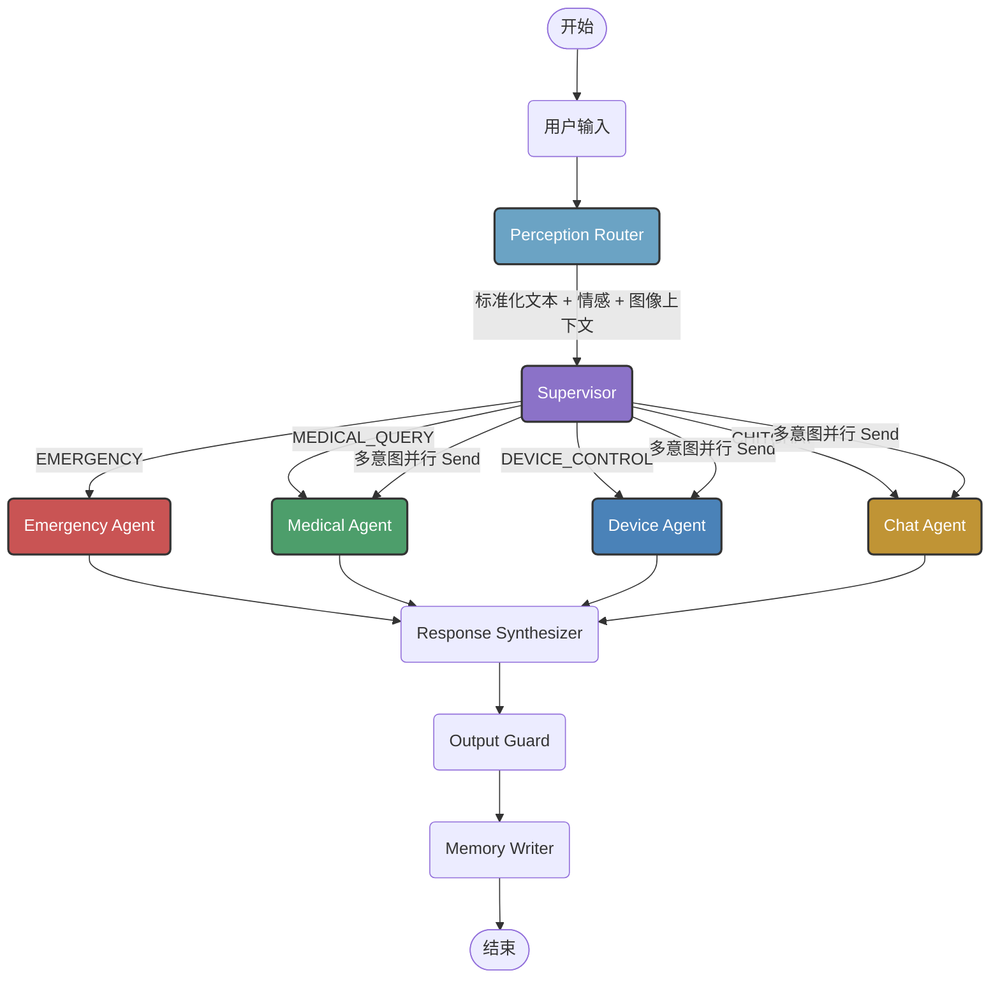
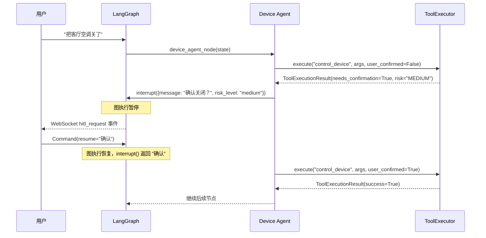

# agent — Multi-Agent 系统

基于 LangGraph 的多 Agent 编排系统。Supervisor 做意图分类和路由，四个子 Agent 分别处理医疗问答、设备控制、闲聊陪伴、紧急响应，最后经回复合成、安全校验、记忆写入三个后处理节点输出。

## 模块总览

```
agent/
├── __init__.py         # 延迟导入，对外暴露 initialize_agent, build_agent_graph, AgentState, create_initial_state
├── bootstrap.py        # 统一启动入口，一次性完成所有依赖注入
├── graph.py            # LangGraph 状态图拓扑定义与编译
├── state.py            # AgentState (TypedDict) + create_initial_state 工厂
├── llm.py              # LLM 统一调用层（文本生成 + 结构化输出）
├── nodes/              # 各节点实现（详见 nodes/README.md）
├── memory/             # 记忆子系统（详见 memory/README.md）
└── tools/              # 工具执行引擎（详见 tools/README.md）
```

## 图拓扑



路由方式：
- 单意图 → `route_by_intent` 返回节点名字符串，串行进入对应子 Agent
- 多意图 → `route_by_intent` 返回 `list[Send]`，LangGraph 并行分发到多个子 Agent
- Emergency → 短路，忽略其他所有意图

子 Agent 完成后统一收敛到 Response Synthesizer，然后走 Output Guard → Memory Writer → END。

## bootstrap.py — 启动入口

`initialize_agent()` 是整个 Agent 系统的唯一启动入口。依赖注入在这里集中完成，运行时不再有延迟初始化。

```python
graph = initialize_agent(
    checkpointer=None,          # None → MemorySaver (内存)；生产可传 SqliteSaver/RedisSaver
    skip_rag=False,             # True → 跳过 RAGPipeline 初始化
    profile_manager=None,       # None → SQLite UserProfileManager；可传入 RedisStore
)
```

初始化顺序：

```
1. RAGPipeline → set_pipeline() 注入 medical_agent
2. UserProfileManager/RedisStore → set_profile_manager() 注入 memory_writer
   ToolExecutor → set_executor() 注入 device_agent
   ConversationSummarizer → set_summarizer() 注入 output_guard
3. build_agent_graph() → 编译 LangGraph 状态图
```

每个组件失败不阻断启动。RAGPipeline 初始化失败时 medical_agent 走降级路径（返回"建议咨询医生"）。

## graph.py — 图构建

注册 9 个节点，定义边连接关系，编译为 `CompiledStateGraph`。

节点注册和边连接：

```python
graph.set_entry_point("perception_router")
graph.add_edge("perception_router", "supervisor")
graph.add_conditional_edges("supervisor", route_by_intent, {
    "medical": "medical_agent",
    "device": "device_agent",
    "chat": "chat_agent",
    "emergency": "emergency_agent",
    "done": "response_synthesizer",
})
# 四个子 Agent → response_synthesizer → output_guard → memory_writer → END
```

Checkpointer 默认使用 `MemorySaver`（内存），生产环境通过 bootstrap 参数传入持久化 Checkpointer。

## state.py — 全局状态定义

`AgentState` 是所有节点共享的数据契约，基于 `TypedDict`。

### 字段分组

| 分组 | 字段 | 类型 | Reducer | 说明 |
|---|---|---|---|---|
| **对话核心** | `messages` | `list[AnyMessage]` | `add_messages` | LangGraph 管理，自动追加 |
| | `current_sub_query` | `str` | 覆盖 | 当前子查询（并行分发时由 Send 设置） |
| | `conversation_summary` | `str` | 覆盖 | 摘要压缩后的历史文本 |
| **感知层** | `user_emotion` | `str` | 覆盖 | ASR 情感标签 |
| | `current_audio_context` | `str` | 覆盖 | ASR 转写文本 |
| | `current_image_context` | `str` | 覆盖 | VLM 识别结果 |
| | `input_modality` | `dict[str, bool]` | 覆盖 | text/audio/image 三个开关 |
| **规划层** | `pending_intents` | `list[dict]` | 覆盖 | 意图队列（type, sub_query, priority） |
| | `current_agent` | `str` | 覆盖 | 当前子 Agent 名或 "parallel" |
| | `risk_level` | `str` | 覆盖 | low/medium/high/critical |
| | `loop_count` | `int` | 覆盖 | Supervisor 循环计数 |
| | `total_turns` | `int` | 覆盖 | 累计对话轮次（不受压缩影响） |
| **知识层** | `rag_context` | `str` | 覆盖 | RAG 检索上下文 |
| | `linked_entities` | `list[dict]` | `merge_lists` | 实体链接结果（并行安全追加） |
| **记忆层** | `user_profile` | `dict` | 覆盖 | 用户画像 |
| **安全层** | `hallucination_score` | `float` | 覆盖 | 幻觉分数 0.0~1.0 |
| | `safety_flags` | `list[str]` | `merge_lists` | 触发的安全规则 |
| **执行层** | `tool_calls` | `list[dict]` | `merge_lists` | 工具调用请求 |
| | `tool_results` | `list[dict]` | `merge_lists` | 工具执行结果 |
| **输出** | `sub_response` | `list[str]` | `merge_lists` | 子 Agent 回复（并行安全追加） |
| | `final_response` | `str` | 覆盖 | 最终输出文本 |

使用 `merge_lists` reducer 的字段（`linked_entities`, `safety_flags`, `tool_calls`, `tool_results`, `sub_response`）在并行分发时不会互相覆盖，而是自动合并。

`create_initial_state()` 返回所有字段的默认值字典，可直接传入 `graph.invoke()`。

## llm.py — LLM 调用层

所有节点共用的 LLM 调用入口。单例 OpenAI 客户端连接 DashScope。

| 函数 | 输入 | 输出 | 说明 |
|---|---|---|---|
| `call_llm(model, messages, ...)` | 模型名 + messages | `str \| None` | 自由文本生成，失败返回 None |
| `call_llm_parse(model, messages, response_format, ...)` | 模型名 + messages + Pydantic 类 | `T \| None` | 结构化输出，失败返回 None |
| `get_client()` | — | `OpenAI` | 获取单例客户端 |

`call_llm_parse` 使用 OpenAI 的 `chat.completions.parse()`，配合 Pydantic BaseModel 直接获取结构化对象，不需要手动解析 JSON。

## HITL 流程

Device Agent 中的 Human-in-the-Loop 确认流程：



`interrupt()` 暂停整个图的执行。前端通过 WebSocket 收到确认请求后展示弹窗，用户操作后通过 `Command(resume=...)` 恢复。

Emergency Agent 不走 HITL，紧急通知自动 `user_confirmed=True`。

## 子包详情

- [agent/nodes/README.md](nodes/README.md) — 各节点的输入输出契约
- [agent/memory/README.md](memory/README.md) — 对话摘要压缩 + 用户画像持久化
- [agent/tools/README.md](tools/README.md) — 工具 Schema 定义 + 执行引擎 + 风险评级
