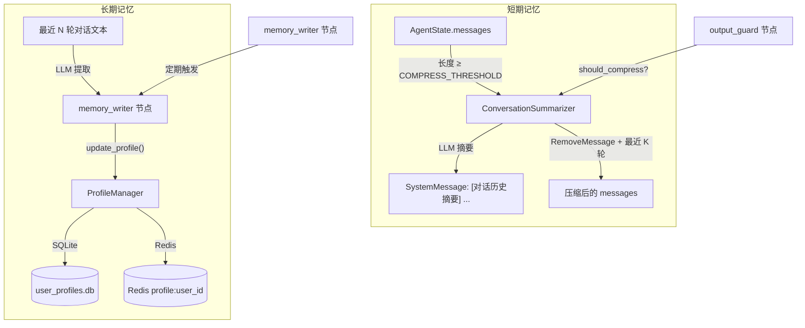

# agent/memory — 记忆子系统

短期对话摘要压缩和长期用户画像持久化。摘要压缩控制 messages 列表长度，用户画像从对话中自动提取健康信息并增量写入。

## 模块总览

```
memory/
├── __init__.py         # 延迟导入
├── summarizer.py       # 对话摘要压缩器
└── user_profile.py     # 用户画像管理（SQLite 后端 + Protocol 接口）
```

## 数据流



## summarizer.py — 对话摘要压缩

当 `messages` 列表长度达到阈值时，将早期消息压缩为摘要，保留最近几轮原始消息。

**类：`ConversationSummarizer`**

| 方法 | 输入 | 输出 | 说明 |
|---|---|---|---|
| `should_compress(state)` | `AgentState` | `bool` | 消息数 ≥ `max_turns` 时返回 True |
| `compress(state)` | `AgentState` | `dict` | 执行压缩，返回状态更新 |

构造参数（均有默认值，从 config 读取）：

| 参数 | 默认值 | 说明 |
|---|---|---|
| `max_turns` | 14 (`COMPRESS_THRESHOLD`) | 触发压缩的消息数阈值 |
| `keep_recent` | 6 (`KEEP_RECENT_TURNS`) | 保留的最近轮数 |
| `summary_max_tokens` | 400 (`SUMMARY_MAX_TOKENS`) | 摘要最大 token 数 |

`compress()` 的执行流程：

```
1. 将 messages 分为两部分：
   old_messages = messages[:-keep_recent*2]  (待压缩)
   recent_messages = messages[-keep_recent*2:]  (保留)

2. 将 old_messages 格式化为对话文本 → 调 LLM 生成 ≤200 字摘要

3. 用 LangGraph 的 RemoveMessage 语义替换 messages：
   [RemoveMessage(REMOVE_ALL), SystemMessage("[对话历史摘要] ..."), ...recent_messages]
```

摘要 LLM prompt 要求保留三类信息：
- 用户提到的健康状况、症状、用药信息
- 用户已完成的操作（设备控制、提醒设置等）
- 对话结论和待办事项

摘要生成失败时返回 `{"conversation_summary": "[自动摘要失败...]"}`，不删除原始消息，避免信息丢失。

**调用方：** `output_guard` 节点在每轮结束时调用 `should_compress()`，条件满足时执行 `compress()`。

## user_profile.py — 用户画像管理

### ProfileManagerProtocol

运行时可替换的接口协议（`@runtime_checkable Protocol`）：

```python
class ProfileManagerProtocol(Protocol):
    def get_profile(self, user_id: str) -> dict[str, Any]: ...
    def update_profile(self, user_id: str, updates: dict[str, Any]) -> dict[str, Any]: ...
    def delete_profile(self, user_id: str) -> bool: ...
```

两个实现：
- `UserProfileManager` — SQLite 后端，本文件内定义，开发环境使用
- `RedisStore` — Redis 后端，定义在 `server/redis_store.py`，生产环境使用

通过 `bootstrap.py` 的 `profile_manager` 参数注入，`memory_writer` 节点通过 Protocol 调用，不感知底层存储。

### UserProfileManager (SQLite)

**类：`UserProfileManager`**

| 方法 | 说明 |
|---|---|
| `get_profile(user_id)` | 获取画像，不存在则自动创建默认画像 |
| `update_profile(user_id, updates)` | 增量更新，列表字段合并去重，字典字段深度合并 |
| `delete_profile(user_id)` | 删除画像 |

默认画像模板（`DEFAULT_PROFILE`）：

```python
{
    "user_id": "",
    "chronic_diseases": [],         # 慢性疾病
    "allergies": [],                # 过敏史
    "current_medications": [],      # 当前用药 [{name, dosage}]
    "emergency_contacts": [],       # 紧急联系人 [{name, phone}]
    "preferred_dialect": "",        # 方言偏好
    "interaction_patterns": {       # 交互模式
        "active_hours": "6:00-21:00",
        "avg_session_turns": 0,
    },
    "created_at": "",
    "updated_at": "",
}
```

`update_profile` 的合并逻辑：

| 已有字段类型 | 新值类型 | 行为 |
|---|---|---|
| `list` | `list` | 逐项追加，跳过已存在的项 |
| `dict` | `dict` | 递归深度合并 |
| 其他 | 同类型 | 直接覆盖 |
| 任意 | 不同类型 | 跳过并记录警告 |
| 不存在 | 任意 | 直接写入 |

`user_id`、`created_at`、`updated_at` 三个字段不可被 updates 覆盖。

SQLite 表结构：

```sql
CREATE TABLE user_profiles (
    user_id     TEXT PRIMARY KEY,
    profile     TEXT NOT NULL,      -- JSON 序列化
    created_at  TEXT NOT NULL,
    updated_at  TEXT NOT NULL
);
```

写入使用 `INSERT ... ON CONFLICT DO UPDATE`，保证 upsert 语义。
