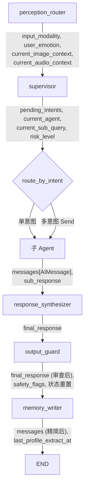
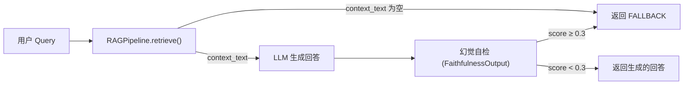

# agent/nodes — Agent 节点

LangGraph 状态图中的 9 个节点实现。每个节点是一个函数，接收 `AgentState`，返回部分状态更新 `dict`。

## 模块总览

```
nodes/
├── __init__.py                 # 延迟导入
├── helpers.py                  # 节点间共享的工具函数
├── perception_router.py        # 入口节点：多模态输入标准化
├── supervisor.py               # 意图分类 + 路由调度
├── medical_agent.py            # 医疗问答（RAG + 幻觉检测）
├── device_agent.py             # 设备控制（解析 + 风险 + 执行）
├── chat_agent.py               # 情绪感知闲聊
├── emergency_agent.py          # 紧急响应
├── response_synthesizer.py     # 多回复合成
├── output_guard.py             # 安全校验 + 摘要压缩
└── memory_writer.py            # 消息精简 + 画像提取
```

## 节点执行顺序与数据流



## helpers.py — 共享工具函数

| 函数 | 输入 | 输出 | 说明 |
|---|---|---|---|
| `extract_latest_query(state)` | `AgentState` | `str` | 有 `current_sub_query` 时直接返回（子 Agent 场景），否则从 messages 中找最后一条 HumanMessage |
| `build_profile_summary(profile)` | `dict` | `str` | 画像格式化为 "慢性病: X；过敏史: Y；当前用药: Z" |
| `message_to_text(message)` | `AnyMessage` | `str` | 兼容 str/list[dict]/list[str] 三种 content 格式，提取多模态上下文 |
| `messages_to_text(messages)` | `list[AnyMessage]` | `str` | 批量转文本，加角色前缀 |
| `get_conversation_context(messages, max_turns)` | messages + 轮数 | `str` | 提取本轮 HumanMessage 之前的历史消息（不含本轮） |
| `extract_ai_messages_after_last_human(messages)` | `list[AnyMessage]` | `(str, list[AIMessage])` | 提取最后一条 HumanMessage 之后的所有 AIMessage |
| `filter_turn_messages(messages)` | `list[AnyMessage]` | `list[AnyMessage]` | 只保留 System + Human + 标记 is_final_response 的 AI 消息 |

---

## 各节点输入输出契约

### perception_router — 感知路由

**输入：** `state["messages"][-1]` (HumanMessage)

HumanMessage.content 格式：
- 纯文本：`str`
- 多模态：`list[dict]`，每项 `{"type": "text"/"image_url"/"audio_url", ...}`

**处理：**

```
1. 检测模态（text/audio/image）
2. 有音频 → AudioProcessor.process() → AudioResult (content + emotion + language)
3. 有图片 → VisionProcessor.process() → str (OCR/描述)
4. 有多模态输入时重写 HumanMessage（保留原 ID，附加 additional_kwargs）
```

**输出字段：**

| 字段 | 值 |
|---|---|
| `input_modality` | `{"text": bool, "audio": bool, "image": bool}` |
| `user_emotion` | ASR 情感标签或 `"NEUTRAL"` |
| `current_image_context` | VLM 识别结果或 `""` |
| `current_audio_context` | ASR 转写文本或 `""` |
| `messages` | 仅多模态时重写 HumanMessage（`id` 不变，触发 LangGraph 替换语义） |

### supervisor — 意图分类与路由

**输入：** 标准化后的 `AgentState`

**处理：**

```
1. 循环保护：loop_count ≥ MAX_SUPERVISOR_LOOPS → current_agent="done"
2. LLM 结构化输出 → SupervisorOutput(intents, risk_level)
3. 按 priority 排序意图
4. Emergency 短路：只保留 EMERGENCY 意图
5. 单意图：current_agent = 对应节点名
6. 多意图：current_agent = "parallel"
```

**LLM 输出结构 (`SupervisorOutput`)：**

```json
{
  "intents": [
    {"type": "MEDICAL_QUERY", "sub_query": "阿司匹林的用法用量", "priority": 1},
    {"type": "DEVICE_CONTROL", "sub_query": "设置明天早上7点吃药提醒", "priority": 2}
  ],
  "risk_level": "low"
}
```

**输出字段：**

| 字段 | 值 |
|---|---|
| `pending_intents` | 排序后的意图列表 |
| `current_agent` | 节点名 / `"parallel"` / `"done"` |
| `current_sub_query` | 单意图时填入 sub_query |
| `risk_level` | 整体风险等级 |
| `loop_count` | 1 |
| `total_turns` | +1 |

**路由函数 `route_by_intent(state)`：**

| current_agent 值 | 返回 | 行为 |
|---|---|---|
| `"medical"` / `"device"` / `"chat"` / `"emergency"` | `str` | 串行路由 |
| `"parallel"` | `list[Send]` | 同类型意图合并后并行分发 |
| `"done"` | `"done"` | 跳过子 Agent，直接进 synthesizer |

并行分发时同类型意图的 sub_query 用 `；` 拼接，避免同一个 Agent 被分发多次。

### medical_agent — 医疗问答

**输入：** `current_sub_query` 或最后一条 HumanMessage

**处理：三阶段流水线**



**幻觉检测结构 (`FaithfulnessOutput`)：**

```json
{"hallucination_score": 0.08, "unsupported_claims": [], "verdict": "pass"}
```

**输出字段：**

| 字段 | 值 |
|---|---|
| `messages` | `[AIMessage(回答文本)]` |
| `rag_context` | RAG 检索到的上下文 |
| `rag_query_rewrite` | 重写后的查询 |
| `linked_entities` | 实体链接结果（list[dict]） |
| `hallucination_score` | 幻觉分数 |
| `sub_response` | `[回答文本]` |

RAGPipeline 未注入时走降级：返回 `FALLBACK_RESPONSE`（"建议您咨询专业医生"）。

### device_agent — 设备控制

**输入：** `current_sub_query` 或最后一条 HumanMessage

**处理：**

```
1. LLM 结构化输出 → DeviceParseOutput(tool_calls: [{tool_name, arguments}])
2. 逐个工具调用 → ToolExecutor.execute()
3. 需要确认时 → interrupt() 暂停 → 用户回复 → 恢复执行或取消
```

**输出字段：**

| 字段 | 值 |
|---|---|
| `messages` | `[AIMessage(执行结果摘要)]` |
| `tool_calls` | 解析出的工具调用列表 |
| `tool_results` | 各工具的执行结果 |
| `sub_response` | `[执行结果摘要]` |

确认关键词：`确认, 好的, 是, yes, ok, 好, 执行, 可以`（不区分大小写）。

### chat_agent — 闲聊陪伴

**输入：** `current_sub_query`/HumanMessage + `user_emotion`

**处理：** 根据 emotion 动态调整 prompt 中的情绪应对策略，调 LLM 生成回复。

**情绪 → 兜底回复映射：**

| 情绪 | 兜底文案 |
|---|---|
| NEUTRAL | "我在呢，有什么想聊的吗？" |
| HAPPY | "看您心情不错呀，有什么开心事儿吗？" |
| SAD | "我能感觉到您心情不太好，我陪着您呢。" |
| ANGRY | "我理解您现在的感受，别着急慢慢说。" |
| FEARFUL | "别担心，我就在这里陪着您。需要联系家人吗？" |

**输出字段：** `messages` + `sub_response`

### emergency_agent — 紧急响应

**输入：** 用户紧急描述 + `user_emotion` + `user_profile.emergency_contacts`

**处理：三个并行任务**

```
1. LLM 生成安抚回复（≤80 字）
2. ToolExecutor.execute("send_alert", ..., user_confirmed=True) 逐个通知联系人
3. 标记 safety_flags += ["emergency_triggered"]
```

紧急通知自动跳过 HITL，`user_confirmed=True` 直接执行。

**输出字段：**

| 字段 | 值 |
|---|---|
| `messages` | `[AIMessage(安抚 + 通知状态)]` |
| `tool_results` | 各联系人的通知结果 |
| `safety_flags` | `[..., "emergency_triggered"]` |
| `risk_level` | `"critical"` |
| `sub_response` | `[安抚 + 通知文本]` |

### response_synthesizer — 回复合成

**输入：** 最后一条 HumanMessage 之后的所有 AIMessage

**处理：**

| AI 回复数 | 行为 |
|---|---|
| 0 | 返回空 `final_response` |
| 1 | 直接透传，跳过 LLM |
| ≥ 2 | 编号拼接后调 LLM 合成为一条连贯回复 |

合成 prompt 要求：去重、自然过渡、保留安全提示、≤300 字。

**输出字段：** `final_response`

### output_guard — 安全校验

**输入：** `final_response` 或 `sub_response` 拼接

**处理：四步审查**

```
1. 对话摘要压缩检查 → 条件满足时调 ConversationSummarizer.compress()
2. 敏感内容过滤 → 正则匹配（自杀/自残/制造炸弹等）→ 替换为 [内容已过滤]
3. 医疗安全兜底 → 涉及用药关键词但无就医提示时自动追加
4. 空回复兜底 → 返回默认文案
```

**输出字段：**

除了 `messages`（标记 `is_final_response=True`）和 `final_response` 外，同时重置本轮临时状态：`sub_response=[]`, `current_sub_query=""`, `user_emotion="NEUTRAL"`, `loop_count=0` 等。

### memory_writer — 记忆写入

**输入：** 完整的 `AgentState`

**处理：两件事**

```
1. 消息精简：filter_turn_messages() → RemoveMessage(ALL) + 精简后消息
   保留：SystemMessage + HumanMessage + is_final_response 的 AIMessage
   丢弃：中间思考过程产生的临时 AIMessage

2. 画像提取（节流）：
   条件：total_turns ≥ 2 且距上次提取 ≥ EXTRACT_INTERVAL (默认 6) 轮
   → LLM 从最近对话提取 chronic_diseases / allergies / current_medications
   → ProfileManager.update_profile() 增量写入
```

**画像提取的 LLM 输出 (`ProfileExtractOutput`)：**

```json
{
  "chronic_diseases": ["糖尿病"],
  "allergies": [],
  "current_medications": [{"name": "二甲双胍", "dosage": "500mg/次"}]
}
```

提取规则在 prompt 中约束：
- 只提取用户自述信息，不提取助手回复中的知识
- 只提取确定性陈述，不提取疑问
- 不重复提取已有画像中的内容

**输出字段：** `messages`（精简后）+ `last_profile_extract_at`（更新提取时间点）
