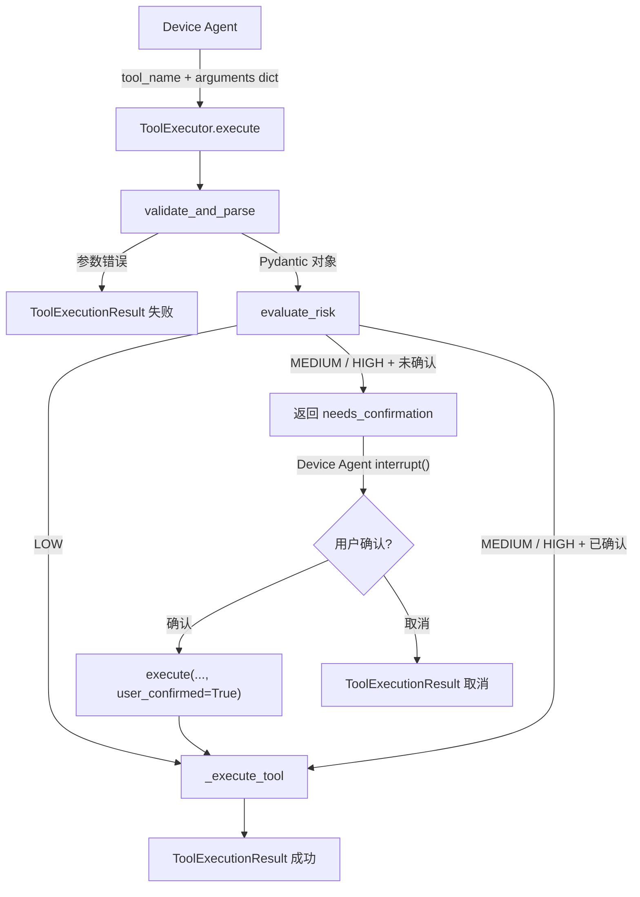

# agent/tools — 工具执行引擎

Device Agent 的工具调用基础设施。定义工具输入 Schema（Pydantic），封装校验 → 风险评估 → 执行/确认的完整流程。

## 模块总览

```
tools/
├── __init__.py      # 延迟导入
├── schemas.py       # 工具输入 Schema + 风险等级枚举 + 工具注册表
└── executor.py      # 工具执行引擎（校验 → 风险 → 执行）
```

## 数据流



## schemas.py — 工具定义

### RiskLevel 枚举

| 值 | 说明 | 行为 |
|---|---|---|
| `LOW` | 查天气、设提醒 | 直接执行 |
| `MEDIUM` | 控制家居设备 | 需要用户确认（interrupt） |
| `HIGH` | 发送紧急通知 | 需要用户确认（interrupt） |

### 工具 Schema

每个工具用一个 Pydantic BaseModel 定义输入参数。`risk_level` 字段声明在 Schema 中，由 LLM 解析时设置或使用默认值。

**`SetReminderInput`**

| 字段 | 类型 | 默认值 | 说明 |
|---|---|---|---|
| `time` | `str` | — | ISO 8601 格式 |
| `message` | `str` | — | 提醒内容 |
| `repeat` | `str` | `"none"` | none / daily / weekly |
| `risk_level` | `RiskLevel` | `LOW` | — |

**`DeviceControlInput`**

| 字段 | 类型 | 默认值 | 说明 |
|---|---|---|---|
| `device_id` | `str` | — | 设备标识（如 `living_room_ac`） |
| `action` | `str` | — | on / off / set / adjust |
| `value` | `str` | `""` | 设置值（温度、亮度等） |
| `risk_level` | `RiskLevel` | `MEDIUM` | — |

**`SendAlertInput`**

| 字段 | 类型 | 默认值 | 说明 |
|---|---|---|---|
| `contact` | `str` | — | 联系人姓名或电话 |
| `message` | `str` | — | 通知内容 |
| `urgency` | `str` | `"normal"` | normal / urgent / critical |
| `risk_level` | `RiskLevel` | `HIGH` | — |

**`WeatherQueryInput`**

| 字段 | 类型 | 默认值 | 说明 |
|---|---|---|---|
| `location` | `str` | — | 查询地点 |
| `date` | `str` | `"today"` | today / tomorrow / 具体日期 |
| `risk_level` | `RiskLevel` | `LOW` | — |

**`CalendarEventInput`**

| 字段 | 类型 | 默认值 | 说明 |
|---|---|---|---|
| `title` | `str` | — | 事件标题 |
| `start` | `str` | — | 开始时间（ISO 8601） |
| `end` | `str` | `""` | 结束时间 |
| `remind_before` | `int` | `30` | 提前提醒分钟数 |
| `risk_level` | `RiskLevel` | `LOW` | — |

### TOOL_REGISTRY

工具名到 Schema 类的映射：

```python
{
    "set_reminder": SetReminderInput,
    "control_device": DeviceControlInput,
    "send_alert": SendAlertInput,
    "query_weather": WeatherQueryInput,
    "set_calendar": CalendarEventInput,
}
```

Device Agent 的 LLM 解析结果中 `tool_name` 必须是这里的 key 之一，否则校验失败。

## executor.py — 执行引擎

**类：`ToolExecutor`**

### 方法

| 方法 | 输入 | 输出 | 说明 |
|---|---|---|---|
| `validate_and_parse(tool_name, arguments)` | 工具名 + 参数 dict | `(Pydantic对象, 错误信息)` | 从 TOOL_REGISTRY 查 Schema，Pydantic 校验 |
| `evaluate_risk(tool_name, parsed_input)` | 工具名 + 解析后对象 | `RiskLevel` | 优先读 Schema 中的 risk_level，否则用默认映射 |
| `execute(tool_name, arguments, user_confirmed)` | 工具名 + 参数 + 确认标志 | `ToolExecutionResult` | 完整流程：校验 → 风险 → 执行或请求确认 |

### execute() 流程

```
1. validate_and_parse → 参数校验失败 → 返回失败结果
2. evaluate_risk → 获取风险等级
3. if MEDIUM/HIGH 且 user_confirmed=False:
     构建确认提示语 → 返回 ToolExecutionResult(needs_confirmation=True)
4. _execute_tool → 模拟执行 → 返回成功结果
```

### ToolExecutionResult

| 字段 | 类型 | 说明 |
|---|---|---|
| `tool_name` | `str` | 工具名 |
| `success` | `bool` | 是否成功 |
| `result` | `Any` | 执行结果数据 |
| `error` | `str` | 错误信息 |
| `needs_confirmation` | `bool` | 是否需要用户确认 |
| `risk_level` | `str` | 风险等级 |
| `to_dict()` | method | 序列化为 dict，写入 AgentState.tool_results |

### 确认提示语模板

| 工具 | 模板 |
|---|---|
| `control_device` | `"{risk_label}操作确认：即将对设备 {device_id} 执行 {action} 操作，确认执行吗？"` |
| `send_alert` | `"{risk_label}操作确认：即将向 {contact} 发送紧急通知...确认发送吗？"` |
| 其他 | `"{risk_label}操作确认：即将执行 {tool_name}，确认继续吗？"` |

### 模拟执行

当前所有工具使用模拟实现（返回固定结构），后续替换为真实 API：

| 工具 | 模拟返回 |
|---|---|
| `query_weather` | `{status, weather: "晴转多云", temperature: "18-25°C", location}` |
| `set_reminder` | `{status: "created", message: "已设置提醒: ..."}` |
| `control_device` | `{status: "executed", message: "设备已执行 ..."}` |
| `send_alert` | `{status: "sent", message: "已向 ... 发送通知"}` |
| `set_calendar` | `{status: "created", message: "已创建日历事件: ..."}` |

## 被谁调用

| 调用方 | 方法 | 场景 |
|---|---|---|
| `agent/nodes/device_agent.py` | `ToolExecutor.execute()` | 工具调用 + HITL 确认 |
| `agent/nodes/emergency_agent.py` | `ToolExecutor().execute("send_alert", ..., user_confirmed=True)` | 紧急通知（跳过确认） |
| `agent/bootstrap.py` | `set_executor()` | 启动时注入单例 |
