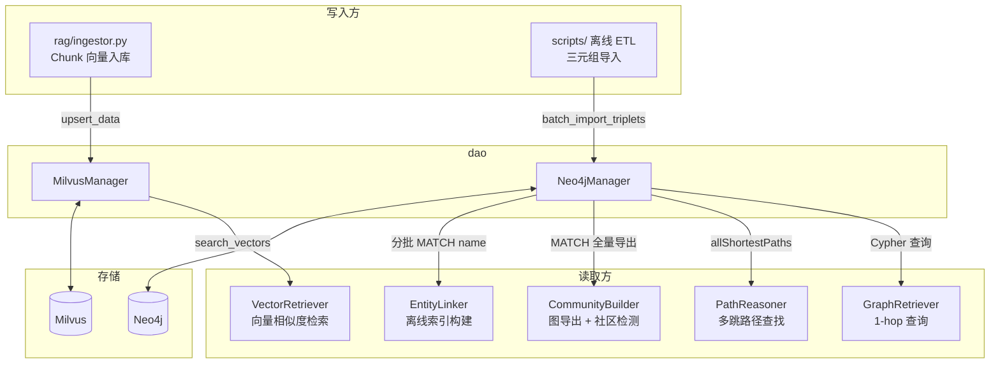

# dao — 数据访问层

封装 Neo4j 知识图谱和 Milvus 向量数据库的底层操作。上层模块（RAG 检索、知识入库、实体链接索引构建）通过这两个 Manager 类与数据库交互，不直接持有连接或编写查询语句。

## 数据流



两个 Manager 的职责边界清晰：Neo4jManager 管图数据的 CRUD，MilvusManager 管向量数据的 CRUD。它们不互相依赖，也不包含业务逻辑。

## 文件说明

### `neo4j_manager.py` — 知识图谱 DAO

通过 `neo4j` Python Driver 连接 Neo4j，封装节点和关系的增删改查。

**初始化：** 构造时自动建立 Bolt 连接，默认读取 `config.NEO4J_URI` / `NEO4J_USER` / `NEO4J_PASSWORD`。

**方法列表：**

| 方法 | 操作 | 说明 |
|---|---|---|
| `batch_import_triplets(triplets)` | 写入 | 按 `(rel_type, start_label, end_label)` 分组，使用 `MERGE` 批量导入三元组。每组一条 Cypher，避免重复创建 |
| `get_node_by_name(label, name)` | 读取 | 根据标签 + 名称精确查询节点属性，返回属性字典 |
| `extract_schema()` | 读取 | 动态提取图谱的所有 Label 和 RelationshipType，用于实体链接索引构建 |
| `update_node_properties(label, name, props)` | 更新 | 增量更新指定节点的属性 |
| `delete_node_and_relationships(label, name)` | 删除 | `DETACH DELETE`，级联删除节点及其所有关联关系 |
| `normalize_label(label)` | 工具 | 静态方法。清洗标签名：处理空值、特殊字符、长度截断，防止 Cypher 注入 |
| `close()` | 管理 | 关闭 Driver 连接 |

**三元组导入数据格式：**

```python
triplet = {
    "start_name": "阿司匹林",
    "start_label": "Drug",
    "end_name": "胃肠道出血",
    "end_label": "AdverseReactions",
    "rel_type": "HAS_SIDE_EFFECT",
    "source": "drug_manual"
}
```

**哪些模块使用 Neo4jManager：**
- `rag/retriever/graph_retriever.py` — 运行时 1-hop 邻居查询
- `rag/retriever/path_reasoner.py` — 运行时多跳路径查找
- `rag/retriever/community_builder.py` — 离线图导出 + 运行时社区缓存加载
- `rag/retriever/entity_linker.py` — 离线索引构建时分批拉取节点名称
- 离线 ETL 脚本 — 三元组批量导入

### `milvus_manager.py` — 向量数据库 DAO

通过 `pymilvus` 连接 Milvus Standalone，封装集合管理、数据写入和向量检索。

**初始化：** 构造时自动连接 Milvus，绑定到指定的 Collection。如果 Collection 已存在，自动挂载并 `load()` 到内存。

**方法列表：**

| 方法 | 操作 | 说明 |
|---|---|---|
| `create_collection(schema, index_field, index_params)` | 管理 | 根据传入的 Schema 动态创建集合并挂载 HNSW 索引 |
| `insert_data(entities)` | 写入 | 批量插入，自动 flush 持久化 |
| `upsert_data(entities)` | 写入 | 主键存在则覆盖，不存在则插入。入库的主要方法 |
| `search_vectors(query_vectors, anns_field, ...)` | 读取 | 向量相似度检索，支持标量过滤表达式 |
| `query_data(expr, output_fields)` | 读取 | 标量精确查询，不走向量计算 |
| `delete_by_expr(expr)` | 删除 | 根据标量表达式删除实体 |

**默认索引配置：**

```python
{
    "metric_type": "COSINE",
    "index_type": "HNSW",
    "params": {"M": 16, "efConstruction": 256}
}
```

**项目中的两个 Collection：**

| Collection | 用途 | 向量字段 | 检索方 |
|---|---|---|---|
| `medical_knowledge_base` | 药品说明书 + 医学文献的文档 chunk | `embedding` | `VectorRetriever` |
| `medical_qa_lite` | 医疗问答对 | `question_vector` | `VectorRetriever` |

两个 Collection 由 `VectorRetriever` 分别实例化各自的 `MilvusManager`。

**search_vectors 参数说明：**

| 参数 | 说明 |
|---|---|
| `query_vectors` | 查询向量列表（支持批量） |
| `anns_field` | 要检索的向量字段名 |
| `limit` | Top-K 召回数量 |
| `expr` | 标量过滤表达式，如 `'doc_type == "drug_manual"'` |
| `output_fields` | 需要随结果返回的字段列表 |
| `search_params` | 搜索控制参数，默认 `{"metric_type": "COSINE", "params": {"ef": 64}}` |

**哪些模块使用 MilvusManager：**
- `rag/ingestor.py` — 文档向量入库（upsert_data）
- `rag/retriever/vector_retriever.py` — 运行时向量检索（search_vectors）

## 配置项

| 配置项 | 说明 | 默认值 |
|---|---|---|
| `NEO4J_URI` | Neo4j Bolt 连接地址 | `bolt://localhost:7687` |
| `NEO4J_USER` | Neo4j 用户名 | `neo4j` |
| `NEO4J_PASSWORD` | Neo4j 密码 | — |
| `MILVUS_HOST` | Milvus 地址 | `localhost` |
| `MILVUS_PORT` | Milvus 端口 | `19530` |
| `MILVUS_COLLECTION_NAME` | 知识库 Collection 名 | `medical_knowledge_base` |
| `MILVUS_KB_COLLECTION` | 知识库 Collection 名（别名） | `medical_knowledge_base` |
| `MILVUS_QA_COLLECTION` | QA 库 Collection 名 | `medical_qa_lite` |
