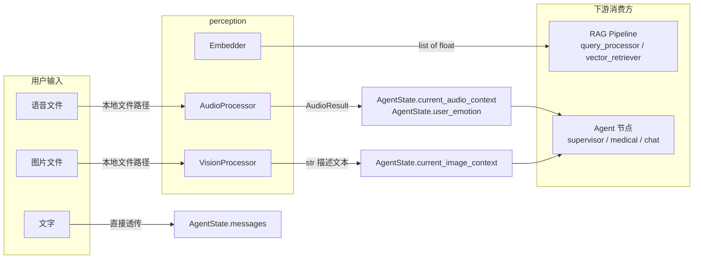

# perception — 多模态感知层

负责将用户的原始输入（文字、语音、图片）统一处理为下游 Agent 可消费的标准化格式。三个模块各自独立，由 Agent 层的 `perception_router` 节点按需调用。

## 数据流



文字输入不经过 perception 处理，直接进入 AgentState。语音和图片各走一条独立管线。Embedder 不在 perception_router 中调用，而是由 RAG 检索流水线在检索阶段按需使用。

## 文件说明

### `audio.py` — 语音识别 + 情感提取

调用 DashScope `qwen3-asr-flash` 模型，一次请求同时完成 ASR 转写和情感识别。

**输入：** 本地音频文件路径（wav / mp3 / pcm / opus）

**输出：** `AudioResult` 数据类

```python
class AudioResult(BaseModel):
    content: str    # 转写文本，如 "我胸口好痛"
    emotion: str    # 情感标签：HAPPY / SAD / ANGRY / NEUTRAL / FEARFUL / DISGUSTED / SURPRISED
    language: str   # 语种标签：zh / en / ja / ...
```

**情感标签的流向：**
1. `perception_router` 将 `emotion` 写入 `AgentState.user_emotion`
2. `supervisor` 在意图分类时读取，FEARFUL + 身体不适会升级为 EMERGENCY
3. `chat_agent` 根据情感标签选择回复策略（SAD → 先共情再引导，ANGRY → 耐心倾听）

**API 调用方式：** 通过 `dashscope.MultiModalConversation.call()` 发送 `file://` 协议的本地路径。模型原生返回情感标签，无需额外模型。

### `vision.py` — 图像理解 + OCR

调用 DashScope Qwen-VL 模型，对图片内容做描述和文字提取。内置一套面向医疗场景的系统 Prompt，针对药品包装、说明书、处方单、血压计读数等场景做了适配。

**输入：** 本地图片文件路径（jpg / png / webp / bmp）

**输出：** `str`，图像内容的文字描述

**识别策略（由系统 Prompt 控制）：**

| 图片类型 | 提取内容 |
|---|---|
| 药品包装 / 说明书 | 药品名称、规格、用法用量、生产厂家、批准文号、有效期 |
| 医疗器械读数 | 血压值、血糖值、体温等数值及单位 |
| 处方 / 检查报告 | 诊断结果、用药建议、检查指标 |
| 其他 | 简洁描述内容 |

**输出文本的流向：**
1. `perception_router` 将结果写入 `AgentState.current_image_context`
2. `supervisor` 意图分类时作为上下文参考
3. `medical_agent` 将图像上下文注入 RAG 的查询处理和回答生成 Prompt
4. `faithfulness_check` 在幻觉检测时也会考虑图像上下文

支持多张图片输入，`perception_router` 对每张图片分别调用 `process()`，结果用换行拼接。

### `embedder.py` — 文本向量化

提供两种后端实现，通过工厂函数 `create_embedder()` 按配置创建。上层调用方只需使用 `encode()` / `encode_query()` 接口。

**类继承结构：**

```
BaseEmbedder (ABC)
├── QwenEmbedder     — 云端 API，DashScope OpenAI 兼容接口
└── BGEM3Embedder    — 本地模型，FlagEmbedding 加载 BAAI/bge-m3
```

**接口定义：**

| 方法 | 说明 |
|---|---|
| `encode(texts: list[str]) -> list[list[float]]` | 批量编码，返回与输入等长的向量列表 |
| `encode_one(text: str) -> list[float]` | 单条便捷方法 |
| `encode_query(query: str) -> list[float]` | 为查询文本添加检索前缀后编码 |

两种后端都在 `encode_query()` 中自动添加前缀 `"Retrieve relevant passages that answer the question: "`，与 BGE-M3 的训练方式对齐。

**Embedder 不在 perception_router 中调用**，使用方为：
- `rag/ingestor.py` — 文档入库时对 chunk 做向量化
- `rag/retriever/vector_retriever.py` — 检索时对 query 做向量化
- `rag/retriever/community_builder.py` — 社区摘要向量化

**两种后端对比：**

| | QwenEmbedder | BGEM3Embedder |
|---|---|---|
| 配置值 | `EMBEDDER_MODE=qwen` | `EMBEDDER_MODE=local` |
| 依赖 | `openai` 库 | `FlagEmbedding` + GPU |
| 向量维度 | 1024（可配置） | 1024 |
| 批次大小 | 25（阿里云限制） | 64 |
| 适用场景 | 开发调试、无 GPU 环境 | 生产部署 |

**工厂函数用法：**

```python
from silver_pilot.perception import create_embedder

embedder = create_embedder("local")   # 或 "qwen"
vectors = embedder.encode(["阿司匹林的用法用量"])
```

## 配置项

| 配置项 | 说明 | 默认值 |
|---|---|---|
| `PERCEPTION_AUDIO_ASR_MODEL` | ASR 模型名 | `qwen3-asr-flash` |
| `VISION_UNDERSTANDING_MODEL` | VLM 模型名 | `qwen3.5-flash` |
| `EMBEDDER_MODE` | 向量化后端 | `local` |
| `EMBEDDER_LOCAL_MODEL` | 本地模型路径 | `BAAI/bge-m3` |
| `EMBEDDER_CLOUD_MODEL` | 云端模型名 | `text-embedding-v3` |
| `DASHSCOPE_API_KEY` | API 密钥 | — |
| `QWEN_REGION` | API 区域 (`cn` / `sg` / `us`) | `cn` |
