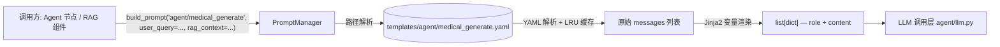

# prompts — Prompt 模板管理

基于 YAML + Jinja2 的 Prompt 模板管理系统。所有 Prompt 集中存放在 `templates/` 目录下，运行时通过路径引用、变量渲染、缓存加载。Agent 节点和 RAG 检索器不直接拼字符串，统一走 `prompt_manager.build_prompt()` 接口。

## 模块总览

```
prompts/
├── __init__.py             # 对外暴露 prompt_manager 单例
├── prompt_manager.py       # 模板加载、渲染、缓存
└── templates/
    ├── example.yaml        # 示例模板
    ├── agent/              # Agent 各节点的 Prompt
    │   ├── chat_generate.yaml
    │   ├── device_parse.yaml
    │   ├── emergency_respond.yaml
    │   ├── faithfulness_check.yaml
    │   ├── medical_generate.yaml
    │   ├── profile_extract.yaml
    │   ├── response_synthesize.yaml
    │   └── supervisor_classify.yaml
    └── rag/                # RAG 各阶段的 Prompt
        ├── context_compress.yaml
        └── query_process.yaml
```

## 数据流



## prompt_manager.py

**类：`PromptManager`**

| 方法 | 输入 | 输出 | 说明 |
|---|---|---|---|
| `build_prompt(path, **kwargs)` | 模板路径 + 模板变量 | `list[dict[str, str]]` | 渲染后的 messages 列表，可直接传给 OpenAI 接口 |
| `get_model_config(path)` | 模板路径 | `dict[str, Any]` | 模板中定义的模型参数（temperature 等） |

内部处理流程：

```
1. _resolve_path(path)      — 路径标准化：补 .yaml 后缀，相对路径拼上 template_dir
2. _get_raw_config(path)     — 读取 YAML 文件，LRU 缓存（maxsize=128）
3. jinja_env.from_string()   — 对 messages 中每条的 content 做 Jinja2 渲染
4. 返回 [{"role": "system", "content": "..."}, {"role": "user", "content": "..."}]
```

路径解析支持两种写法：

```python
# 相对路径（推荐，相对于 templates/ 目录）
prompt_manager.build_prompt("agent/medical_generate", ...)

# 绝对路径
prompt_manager.build_prompt("/path/to/template.yaml", ...)
```

后缀可以省略，自动补 `.yaml`。

**单例实例：`prompt_manager`**

在 `__init__.py` 中实例化并导出，全局共享同一个实例和缓存。

```python
from silver_pilot.prompts import prompt_manager
```

## YAML 模板格式

每个模板文件包含三个顶层字段：

```yaml
name: "template_name"           # 模板标识（文档用途，代码中不引用）
description: "..."              # 模板说明
model_config:                   # 可选，建议的模型参数
  temperature: 0.3
  stop: ["Observation:"]

messages:                       # OpenAI messages 格式
  - role: "system"
    content: |
      你是一个 {{ role_name }}。
      当前时间: {{ current_time }}

  - role: "user"
    content: |
      用户问题: {{ user_query }}
      参考资料: {{ rag_context }}
```

`content` 中使用 Jinja2 语法：`{{ variable }}` 插入变量，`` / `` 做条件和循环。

## 各模板说明

### Agent 模板

| 模板 | 调用方 | 用途 | 主要变量 |
|---|---|---|---|
| `agent/supervisor_classify` | supervisor.py | 意图分类 + 路由 | user_query, user_emotion, current_audio_context, current_image_context, conversation_summary, user_profile_summary |
| `agent/medical_generate` | medical_agent.py | 基于 RAG 上下文生成医疗回答 | user_query, rag_context, current_image_context, user_profile_summary |
| `agent/faithfulness_check` | medical_agent.py | 幻觉检测（结构化输出 JSON） | rag_context, generated_answer, current_image_context |
| `agent/device_parse` | device_agent.py | 自然语言 → 工具调用 JSON | user_query, user_profile_summary, current_time |
| `agent/chat_generate` | chat_agent.py | 情绪感知闲聊 | user_query, user_emotion, current_audio_context, current_image_context, conversation_summary |
| `agent/emergency_respond` | emergency_agent.py | 紧急安抚回复 | user_query, user_emotion, emergency_contacts |
| `agent/response_synthesize` | response_synthesizer.py | 多回复合成 | user_query, agent_responses, response_count |
| `agent/profile_extract` | memory_writer.py | 从对话提取健康信息（结构化输出 JSON） | conversation_text, existing_profile |

### RAG 模板

| 模板 | 调用方 | 用途 | 主要变量 |
|---|---|---|---|
| `rag/query_process` | query_processor.py | 查询重写 + 分解 + NER（结构化输出 JSON） | user_query, image_context, conversation_context |
| `rag/context_compress` | context_builder.py | 多路检索结果提炼去重 | user_query, raw_context |

### 结构化输出模板的约定

需要 LLM 返回 JSON 的模板（faithfulness_check、device_parse、profile_extract、query_process），在 system prompt 中通过以下方式约束输出格式：

1. 在 prompt 末尾写明 `Output Format` 和 JSON schema 示例
2. 调用方使用 `call_llm_parse()` 配合 Pydantic 模型解析（而非 `call_llm()`）
3. temperature 设为 0.0 或 0.1，减少格式偏差

这些模板的 `model_config.temperature` 通常设为 0.0，但调用方不一定读取 `model_config`——实际使用的 temperature 在调用方代码中指定。`model_config` 更多是文档性质的建议值。

## 调用

所有调用方都直接 import 单例：`from silver_pilot.prompts import prompt_manager`。
