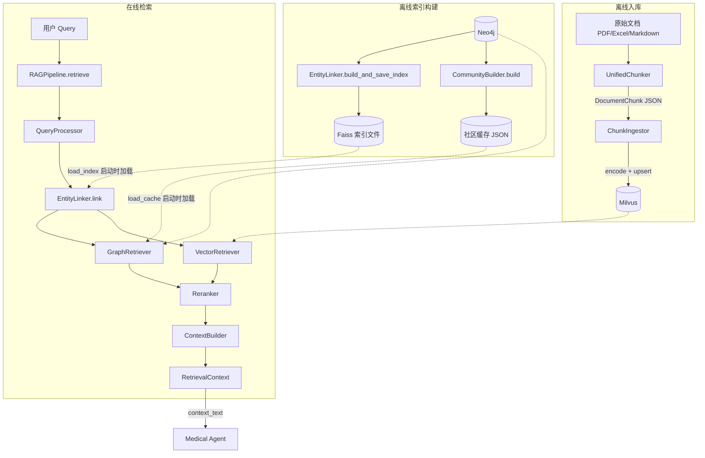

# rag — RAG 知识库构建与检索

从原始文档到最终 prompt context 的完整链路。分两条流程：离线入库（文档 → chunk → embedding → Milvus）和在线检索（query → 多路召回 → 重排 → 上下文构建）。

## 模块总览

```
rag/
├── __init__.py             # 延迟导入，对外暴露 RAGPipeline, PipelineConfig, RetrievalContext, ChunkIngestor
├── ingestor.py             # chunk 向量化入库（JSON → Embedding → Milvus upsert）
├── chunker/                # 文档切片子包
│   ├── chunker_base.py     # 共享数据结构 DocumentChunk + 通用文本分段器 TextSplitter
│   ├── excel_chunker.py    # Excel 按主题分组切片
│   ├── markdown_chunker.py # Markdown 按标题层级切片
│   └── unified_chunker.py  # 统一入口，按文件类型自动分发
└── retriever/              # 混合检索子包
    ├── pipeline.py         # 流水线编排器（统一 retrieve() 接口）
    ├── query_processor.py  # 查询重写 + 分解 + NER
    ├── entity_linker.py    # 实体链接（Faiss + sentence-transformers）
    ├── graph_retriever.py  # GraphRAG 三层检索入口
    ├── community_builder.py # 社区检测 + 摘要（离线构建 + 运行时查询）
    ├── path_reasoner.py    # 多跳推理路径发现
    ├── vector_retriever.py # Milvus 双集合向量检索
    ├── reranker.py         # 重排序（本地 BGE / 云端 Qwen）
    ├── context_builder.py  # 上下文组装（直接拼接 / LLM 压缩）
    ├── models.py           # 检索流水线数据模型
    └── graph_models.py     # GraphRAG 专用数据模型
```

## 两条流程的全局数据流



离线和在线的交汇点：Milvus 里的向量数据（入库写 / 检索读），Faiss 索引文件（离线构建 / 启动加载），社区缓存 JSON（离线构建 / 启动加载）。

## ingestor.py

将 UnifiedChunker 产出的 JSON chunk 文件向量化后写入 Milvus。

**类：`ChunkIngestor`**

| 方法 | 输入 | 输出 | 说明 |
|---|---|---|---|
| `ingest_dir(input_dir)` | JSON 文件目录 | `IngestStats` | 遍历目录，逐文件流式处理（内存中只持有一个文件的数据） |
| `ingest_file(file)` | 单个 JSON 文件 | `IngestStats` | 处理单文件 |

单文件处理流程：

```
读取 JSON → 逐条 _chunk_to_entity() 转为 Milvus 实体格式
→ 按 batch_size 分批 → embedder.encode() 向量化
→ MilvusManager.upsert_data() 写入
```

`_chunk_to_entity()` 的转换逻辑：

| JSON chunk 字段 | Milvus 实体字段 | 处理 |
|---|---|---|
| `chunk_id` (或内容哈希) | `chunk_id` | 优先用 JSON 中已有的 ID，保证 upsert 幂等 |
| `content` | `content` | UTF-8 字节截断（默认 16384 字节），避免截断半个字符 |
| `metadata.doc_title` | `title` | 截断到 512 字节 |
| `group_name` | `group_name` | 截断到 256 字节 |
| `source_file` | `source_file` | 截断到 1024 字节 |
| `doc_type` | `doc_type` | 截断到 64 字节 |
| `sub_index` | `sub_index` | 二次分段的段内序号 |
| — | `created_at` | 当前时间戳 |
| — | `embedding` | encode() 后填入 |

`IngestStats` 记录处理文件数、成功入库数、跳过数、失败批次数、耗时。

## 子包详情

`chunker/` 和 `retriever/` 各自有独立的 README，见：

- [rag/chunker/README.md](chunker/README.md) — 文档切片策略
- [rag/retriever/README.md](retriever/README.md) — 混合检索流水线

## 被谁调用

| 调用方 | 使用的组件 | 场景 |
|---|---|---|
| `agent/nodes/medical_agent.py` | `RAGPipeline.retrieve()` | 在线检索 |
| `agent/bootstrap.py` | `RAGPipeline` + `PipelineConfig` | 系统启动时初始化 |
| 数据入库脚本 | `ChunkIngestor` | 离线向量入库 |
| 数据入库脚本 | `UnifiedChunker` | 离线文档切片 |
| 索引构建脚本 | `EntityLinker.build_and_save_index()` | 离线 Faiss 索引 |
| 索引构建脚本 | `CommunityBuilder.build()` + `save_cache()` | 离线社区构建 |
