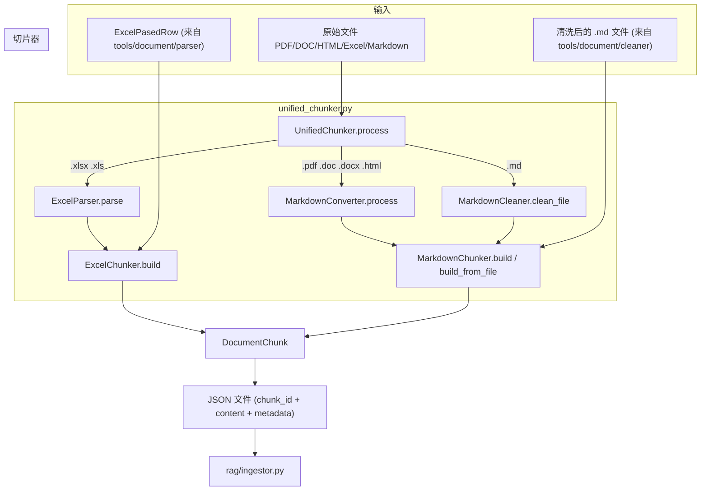
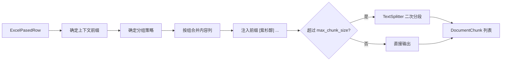
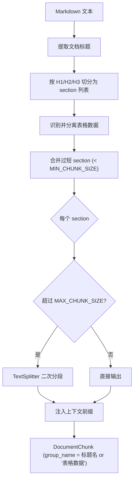

# rag/chunker — 文档切片

将清洗后的文档按语义边界切分为适合 Embedding 的 chunk。两种切片器分别处理 Excel（按主题分组合并行数据）和 Markdown（按标题层级切分），共享同一个 `DocumentChunk` 数据结构和 `TextSplitter` 分段工具。

## 模块总览

```
chunker/
├── __init__.py            # 延迟导入，对外暴露 UnifiedChunker
├── chunker_base.py        # DocumentChunk 数据结构 + TextSplitter 通用分段器
├── excel_chunker.py       # Excel 按主题分组切片
├── markdown_chunker.py    # Markdown 按标题层级切片
└── unified_chunker.py     # 统一入口，按文件类型自动分发
```

## 数据流



两条路径最终都产出 `DocumentChunk`，由 `UnifiedChunker` 序列化为 JSON 保存。

## chunker_base.py

共享数据结构和工具，被 ExcelChunker 和 MarkdownChunker 共同依赖。

### DocumentChunk

一条可入库的 chunk 记录：

| 字段 | 类型 | 说明 |
|---|---|---|
| `group_name` | `str` | 所属主题分组（如"基本信息""临床使用"或标题名） |
| `content` | `str` | chunk 文本（已含上下文前缀） |
| `metadata` | `dict` | 附加元数据（来源文件、标题、原始元数据等） |
| `source_file` | `str` | 原始文件路径 |
| `doc_type` | `str` | `"drug_manual"` 或 `"medical_guideline"` |
| `sub_index` | `int` | 超长文本二次分段后的段内序号 |
| `metadata_json` | property | metadata 序列化为 JSON 字符串 |

`doc_type` 的判定逻辑：文件名包含"药品"或"说明书"→ `drug_manual`，否则 → `medical_guideline`。

### TextSplitter

当文本超过 `max_chunk_size`（默认 800 字符）时，按自然断点分段，前后 chunk 带 `overlap_size`（默认 100 字符）重叠。

断点优先级（从高到低）：

```
\n\n → \n → 。 → ！ → ？ → ； → ， → 强制截断
```

分段时会保护 LaTeX 公式区间（`$...$` 和 `$$...$$`），避免在公式内部截断。

防死循环机制：每次寻找断点时，搜索下限严格大于上次切分位置，start 每轮至少前进 1 字符。

### 常量

| 常量 | 默认值 | 说明 |
|---|---|---|
| `MAX_CHUNK_SIZE` | 800 | 单个 chunk 最大字符数 |
| `MIN_CHUNK_SIZE` | 100 | 低于此值的 section 向前合并 |
| `OVERLAP_LENGTH` | 100 | 二次分段时前后 chunk 重叠字符数 |

## excel_chunker.py

将 `ExcelPasedRow`（来自 `tools/document/parser`）按预定义的主题分组合并为语义聚合的 chunk。

**类：`ExcelChunker`**

| 方法 | 输入 | 输出 |
|---|---|---|
| `build(parsed_row)` | 单条 `ExcelPasedRow` | `list[DocumentChunk]` |
| `build_batch(parsed_rows)` | 迭代器/序列 | `Iterator[DocumentChunk]` |

单行处理流程：



### 主题分组

`ChunkGroup` 定义一个分组的名称和包含的列：

```python
ChunkGroup(name="基本信息", columns=["性状", "主要成份", "适应症", "规格", "贮藏"])
```

项目内置药品说明书分组 `DRUG_INSTRUCTION_GROUPS`：

| 分组名 | 包含的列 |
|---|---|
| 基本信息 | 性状、主要成份、相关疾病、适应症、规格、贮藏、有效期 |
| 临床使用 | 用法用量、不良反应、禁忌、注意事项、孕妇及哺乳期妇女用药、儿童用药、老人用药 |
| 药理信息 | 药物相互作用、药理毒理、药代动力学 |

同组内的多列文本用 `\n` 拼接，每列前加粗标注列名（如 `**用法用量**...`）。未被任何分组覆盖的列自动归入"其他"组。

### 上下文前缀

通过 `context_prefix_field` 指定用于前缀的元数据字段（如 `"通用名称"`）。切片后每个 chunk 的文本以 `**紫杉醇** ...` 开头，确保检索命中时能看到药品名称。

二次分段后的每个子 chunk 都会重新注入前缀，不会丢失。

## markdown_chunker.py

将 Markdown 文档按标题层级切分，支持表格独立、短 section 合并、超长 section 递归切分。

**类：`MarkdownChunker`**

| 方法 | 输入 | 输出 |
|---|---|---|
| `build(md_text, source_file)` | Markdown 字符串 | `list[DocumentChunk]` |
| `build_from_file(file_path)` | .md 文件路径 | `list[DocumentChunk]` |

处理流程：



### 五步策略

**1. 标题切分**

按 `split_headers`（默认 `[1, 2, 3]`）指定的标题级别切分。每个 section 记录标题文本、层级、内容、层级路径。

路径栈维护示例：遇到 `## 临床使用` 时弹出所有 >= H2 的标题，压入当前标题，最终路径为 `["文档标题", "临床使用"]`。

**2. 表格独立**

在每个 section 内扫描线性化表格行（特征：一行内包含 ≥ 2 个"字段: 值"模式）。连续 ≥ 2 行表格数据被分离为独立的表格 section，`is_table=True`。

**3. 短 section 合并**

内容字符数 < `min_chunk_size`（默认 100）的 section 向前合并到上一个非表格 section，合并后不超过 `max_chunk_size` 才执行。表格 section 不参与合并。

**4. 超长 section 切分**

使用共享的 `TextSplitter` 按中文标点断点二次分段，带 overlap。

**5. 上下文前缀**

启用 `context_prefix`（默认 True）时，每个 chunk 前注入 `[文档标题 > 章节路径]` 格式的前缀。例如：`[高血压诊疗方案 > 临床使用 > 药物治疗] 一线降压药包括...`

### MarkdownSection 数据结构

| 字段 | 类型 | 说明 |
|---|---|---|
| `level` | `int` | 标题级别（1-6），0 表示文档顶层 |
| `title` | `str` | 标题文本 |
| `content` | `str` | 该标题下的正文 |
| `path` | `list[str]` | 层级路径 |
| `is_table` | `bool` | 是否为表格数据 |

## unified_chunker.py

对外统一入口。接收文件或目录，按后缀名分发到对应切片器，输出 JSON。

**类：`UnifiedChunker`**

| 方法 | 输入 | 输出 |
|---|---|---|
| `process(source_path, output_dir, ...)` | 文件或目录路径 | JSON 文件（写入 output_dir） |
| `process_file(file_path, output_dir, ...)` | 单个文件路径 | JSON 文件 |

文件类型分发：

| 后缀 | 处理路径 |
|---|---|
| `.xlsx` `.xls` | ExcelParser → ExcelChunker |
| `.pdf` `.doc` `.docx` `.html` | MarkdownConverter（MinerU + 清洗）→ MarkdownChunker |
| `.md` | MarkdownCleaner → MarkdownChunker |
| 其他 | 跳过 |

JSON 输出格式（每个 chunk 一条记录）：

```json
{
  "chunk_id": "sha256 哈希",
  "content": "chunk 文本",
  "group_name": "基本信息",
  "metadata": {"doc_title": "...", "section_path": "..."},
  "source_file": "原始文件路径",
  "doc_type": "drug_manual",
  "sub_index": 0
}
```

`chunk_id` 由 `source_file | group_name | sub_index | content` 拼接后取 SHA-256，保证相同内容生成相同 ID，支持 Milvus upsert 幂等。

## 被谁调用

| 调用方 | 使用的组件 | 场景 |
|---|---|---|
| `rag/ingestor.py` | — (读取 JSON 输出) | 向量化入库 |
| 数据入库脚本 | `UnifiedChunker.process()` | 批量文档处理 |
