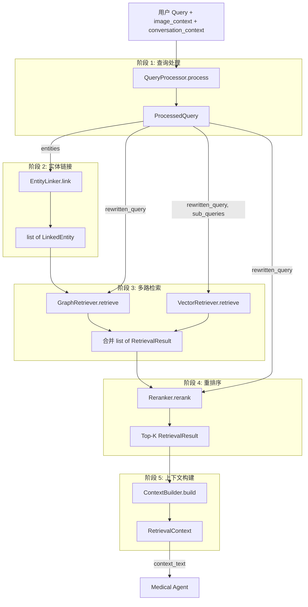
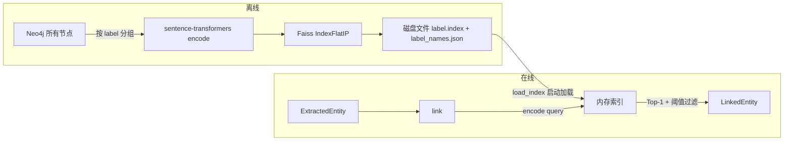
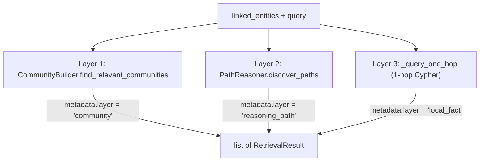

# rag/retriever — 混合检索流水线

GraphRAG + 向量多路召回的完整检索系统。从用户 query 到最终 prompt context，经过查询处理、实体链接、多路检索、重排序、上下文构建五个阶段。

## 模块总览

```
retriever/
├── __init__.py             # 延迟导入
├── pipeline.py             # 流水线编排器（统一 retrieve() 接口）
├── models.py               # 检索流水线数据模型
├── graph_models.py         # GraphRAG 专用数据模型
│
│  ── 阶段 1: 查询处理 ──
├── query_processor.py      # 查询重写 + 分解 + NER（一次 LLM 调用）
│
│  ── 阶段 2: 实体链接 ──
├── entity_linker.py        # NER 实体 → Neo4j 标准节点（Faiss 语义匹配）
│
│  ── 阶段 3: 多路检索 ──
├── graph_retriever.py      # GraphRAG 三层检索入口
├── community_builder.py    # Layer 1: 社区检测 + 摘要（离线构建 / 运行时查询）
├── path_reasoner.py        # Layer 2: 多跳推理路径发现
├── vector_retriever.py     # Milvus 双集合向量检索（QA 库 + 知识库）
│
│  ── 阶段 4: 重排序 ──
├── reranker.py             # 统一重排（本地 BGE / 云端 Qwen）
│
│  ── 阶段 5: 上下文构建 ──
└── context_builder.py      # 层级化拼接或 LLM 压缩
```

## 全局数据流



## 数据模型 (models.py)

流水线各阶段的输入输出结构。

### 实体相关

**`EntityLabel`** — 与 Neo4j Schema 对齐的枚举，36 种医学实体类型：

```
Disease, Symptom, Drug, Complication, Treatment, Check, Operation,
AdverseReactions, Indications, Precautions, ... , Unknown
```

**`ExtractedEntity`** — NER 阶段的原始输出：

| 字段 | 类型 | 说明 |
|---|---|---|
| `name` | `str` | 实体名称（如"阿司匹林"） |
| `label` | `EntityLabel` | 实体类型 |
| `confidence` | `float` | 置信度（默认 1.0） |

**`LinkedEntity`** — 实体链接后的结果：

| 字段 | 类型 | 说明 |
|---|---|---|
| `original_name` | `str` | NER 输出的原始名称 |
| `label` | `EntityLabel` | 实体类型 |
| `neo4j_name` | `str \| None` | 图谱中的标准名称（链接成功时） |
| `similarity_score` | `float` | 语义相似度分数 |
| `is_linked` | `bool` | 是否链接成功 |
| `best_name` | property | 优先返回 neo4j_name，否则 original_name |

### 查询处理

**`ProcessedQuery`** — 查询处理阶段的完整输出：

| 字段 | 类型 | 说明 |
|---|---|---|
| `original_query` | `str` | 用户原始输入 |
| `rewritten_query` | `str` | 规范化改写后的查询 |
| `sub_queries` | `list[str]` | 分解后的子问题（单意图时为空） |
| `entities` | `list[ExtractedEntity]` | 抽取的医学实体 |
| `all_queries` | property | rewritten_query + sub_queries 去重后的列表 |

### 检索结果

**`RetrievalSource`** — 来源枚举：

| 值 | 说明 |
|---|---|
| `NEO4J_GRAPH` | Neo4j 图谱检索（含社区、推理路径、局部事实） |
| `MILVUS_QA` | Milvus QA 问答库 |
| `MILVUS_KNOWLEDGE` | Milvus 知识库 |

**`RetrievalResult`** — 单条检索结果：

| 字段 | 类型 | 说明 |
|---|---|---|
| `content` | `str` | 检索到的文本内容 |
| `source` | `RetrievalSource` | 来源标识 |
| `score` | `float` | 原始检索分数 |
| `metadata` | `dict` | 附加信息（来源文件、关系类型、layer 等） |
| `rerank_score` | `float \| None` | 重排后的分数（Reranker 填充） |
| `final_score` | property | 优先取 rerank_score，否则取 score |

**`RetrievalContext`** — 流水线最终输出：

| 字段 | 类型 | 说明 |
|---|---|---|
| `context_text` | `str` | 拼装好的 prompt context，直接注入生成 prompt |
| `ranked_results` | `list[RetrievalResult]` | 重排后的检索结果 |
| `processed_query` | `ProcessedQuery` | 查询处理中间状态 |
| `linked_entities` | `list[LinkedEntity]` | 实体链接中间状态 |
| `retrieval_stats` | `dict[str, int]` | 各路召回数量统计 |

## 数据模型 (graph_models.py)

GraphRAG 专用结构。

**`GraphNode`** / **`GraphEdge`** — 图谱中的节点和边，包含 name、label、properties / source、target、relation。

**`ReasoningPath`** — 多跳推理路径：

| 字段 | 类型 | 说明 |
|---|---|---|
| `nodes` | `list[GraphNode]` | 路径上的有序节点 |
| `edges` | `list[GraphEdge]` | 路径上的有序边 |
| `hops` | `int` | 跳数 |
| `natural_language` | `str` | LLM 生成的自然语言解释 |
| `relevance_score` | `float` | 与用户 query 的相关性 |
| `path_signature` | property | 节点名拼接，用于去重 |
| `to_triplet_chain()` | method | 转为 `(A)-[rel]->(B)` 格式 |

**`Community`** — 社区：

| 字段 | 类型 | 说明 |
|---|---|---|
| `community_id` | `int` | 唯一标识 |
| `node_names` | `list[str]` | 包含的实体名称 |
| `node_labels` | `list[str]` | 各实体的类型 |
| `edge_count` | `int` | 社区内部边数 |
| `summary` | `str` | LLM 生成的摘要 |
| `summary_embedding` | `list[float]` | 摘要向量（运行时语义匹配用） |
| `keywords` | `list[str]` | 摘要关键词 |

**`SubgraphContext`** — GraphRAG 的结构化输出（内部使用，最终转为 RetrievalResult 列表）：

| 字段 | 类型 |
|---|---|
| `reasoning_paths` | `list[ReasoningPath]` |
| `community_summaries` | `list[Community]` |
| `local_facts` | `list[str]` |

---

## pipeline.py — 流水线编排器

串联五个阶段，提供统一的 `retrieve()` 接口。

**`PipelineConfig`** — 可调参数集合：

| 分组 | 配置项 | 说明 | 来源 |
|---|---|---|---|
| 查询处理 | `query_model` | LLM 模型 | `config.QUERY_PROCESS_MODEL` |
| 实体链接 | `linking_threshold` | 匹配阈值 | `config.ENTITY_LINK_THRESHOLD` |
| 向量检索 | `vector_top_k` | 每个集合返回数 | `config.VECTOR_RETRIEVAL_TOP_K` |
| 向量检索 | `qa_enabled` / `kb_enabled` | 开关 | `config.VECTOR_QA_ENABLED` |
| 图谱检索 | `graph_enable_community` / `graph_enable_reasoning` | 开关 | config |
| 重排序 | `reranker_backend` / `rerank_top_k` | 后端和 Top-K | config |
| 上下文 | `context_mode` / `max_context_chars` | 模式和上限 | config |

**`RAGPipeline`**

| 方法 | 说明 |
|---|---|
| `initialize()` | 创建所有组件实例，加载模型和索引。启动时调用一次 |
| `retrieve(user_query, ...)` | 执行完整五阶段检索，返回 `RetrievalContext` |
| `close()` | 释放资源 |

`retrieve()` 的执行流程：

```
1. QueryProcessor.process(user_query, image_context, conversation_context)
   → ProcessedQuery

2. EntityLinker.link(processed_query.entities)
   → list[LinkedEntity]

3a. GraphRetriever.retrieve(linked_entities, query, query_embedding)
   → list[RetrievalResult]  (source=NEO4J_GRAPH)

3b. VectorRetriever.retrieve(processed_query, top_k, ...)
   → list[RetrievalResult]  (source=MILVUS_QA / MILVUS_KNOWLEDGE)

4. Reranker.rerank(query, all_results, top_k)
   → list[RetrievalResult]  (按 rerank_score 排序)

5. ContextBuilder.build(ranked_results, user_query)
   → context_text (str)
```

每个阶段失败不阻断后续。无实体时跳过图谱检索，无召回时跳过重排。

---

## query_processor.py — 阶段 1

一次 LLM 调用同时完成查询重写、查询分解、医学实体抽取。

**类：`QueryProcessor`**

输入：用户原始 query + 可选的 image_context（OCR 结果）+ conversation_context（对话摘要）

输出：`ProcessedQuery`

内部步骤：

```
1. prompt_manager.build_prompt("rag/query_process", ...)  构建 prompt
2. client.chat.completions.parse(..., response_format=QueryProcessOutput)  结构化输出
3. 将 EntityItem 转为 ExtractedEntity（label 匹配失败归入 UNKNOWN）
```

LLM 返回的 JSON 格式（由 Pydantic `QueryProcessOutput` 校验）：

```json
{
  "rewritten_query": "降压药与头孢类抗生素是否存在药物相互作用",
  "sub_queries": [],
  "entities": [
    {"name": "降压药", "label": "Drug"},
    {"name": "头孢类抗生素", "label": "Drug"}
  ]
}
```

降级方案：LLM 调用失败时返回 `ProcessedQuery(rewritten_query=原始query, entities=[], sub_queries=[])`。

---

## entity_linker.py — 阶段 2

将 NER 抽取的实体名称链接到 Neo4j 中的标准节点。按 label 分组建立 Faiss 索引，运行时用语义相似度匹配。

**类：`EntityLinker`**

生命周期分离线和在线两个阶段：



| 方法 | 阶段 | 说明 |
|---|---|---|
| `build_and_save_index(save_dir)` | 离线 | 从 Neo4j 逐 label 导出节点名 → encode → 构建 Faiss → 存磁盘 |
| `load_index(load_dir)` | 在线 | 从磁盘加载所有 label 的 Faiss 索引和名称映射 |
| `link(entities)` | 在线 | 批量链接 |

单个实体的链接策略（`_link_single`）：

```
1. 精确匹配：实体名直接存在于对应 label 的 names 列表 → score=1.0
2. 语义匹配：在对应 label 的 Faiss 索引中 Top-1 检索 → 阈值过滤
3. 跨 label 兜底：遍历所有其他 label 的索引 → 取全局最高分 → 阈值过滤
4. 未命中：is_linked=False
```

默认阈值 `config.ENTITY_LINK_THRESHOLD`（0.85）。

索引文件结构（每个 label 两个文件）：

```
data/rag/entity_indices/
├── Drug.index          # Faiss 二进制索引
├── Drug_names.json     # ["阿司匹林", "布洛芬", ...]
├── Disease.index
├── Disease_names.json
└── ...
```

---

## graph_retriever.py — 阶段 3a

GraphRAG 三层检索的入口。内部协调 CommunityBuilder（Layer 1）和 PathReasoner（Layer 2），自身实现 Layer 3。

**类：`GraphRetriever`**

| 方法 | 说明 |
|---|---|
| `initialize()` | 加载社区缓存，初始化 PathReasoner |
| `retrieve(linked_entities, query, query_embedding)` | 执行三层检索，返回统一的 `list[RetrievalResult]` |

三层检索的执行顺序和输出：



每条 RetrievalResult 的 `metadata["layer"]` 标记来源层级，供 ContextBuilder 做层级化组装。

### Layer 3 实现 (`_query_one_hop`)

对每个已链接实体执行 Cypher：

```cypher
MATCH (n:`{label}` {name: $name})-[r]->(m)
WHERE m.name IS NOT NULL
RETURN type(r), m.name, labels(m)
LIMIT $limit
```

三元组转自然语言时使用 `RELATION_DESCRIPTIONS` 映射表（36 种关系类型 → 中文描述模板）：

```
"阿司匹林" + "AdverseReactions" + "胃肠道出血"
→ "阿司匹林的不良反应包括胃肠道出血"
```

通过 `config.GRAPH_RETRIEVER_ENABLE_COMMUNITY` 和 `config.GRAPH_RETRIEVER_ENABLE_REASONING` 可以独立关闭 Layer 1 和 Layer 2。

---

## community_builder.py — Layer 1

离线阶段执行社区检测和摘要生成，运行时通过缓存快速查询。

**类：`CommunityBuilder`**

### 离线构建（`build()`）

```mermaid
graph LR
    A["Neo4j 全图"] -->|_export_to_networkx| B[NetworkX Graph]
    B -->|"Leiden (graspologic)"| C[社区分区]
    C -->|"过滤: MIN_SIZE ≤ size ≤ MAX_SIZE"| D[Community 列表]
    D -->|"LLM 摘要 (逐社区)"| E[带摘要的 Community]
    E -->|"embedder.encode"| F[带向量的 Community]
    F -->|save_cache| G["communities.json"]
```



社区过滤参数：

| 参数 | 默认值 | 说明 |
|---|---|---|
| `MIN_COMMUNITY_SIZE` | 3 | 小于此节点数的社区忽略 |
| `MAX_COMMUNITY_SIZE_FOR_SUMMARY` | 200 | 大于此节点数的社区跳过 LLM 摘要 |

LLM 摘要使用 `CommunitySummaryOutput`（Pydantic 结构化输出）：

```json
{"summary": "该社区包含...", "keywords": ["阿司匹林", "抗凝", ...]}
```

Leiden 算法不可用时回退到 NetworkX 的 Louvain。

### 运行时查询（`find_relevant_communities()`）

双路检索 + 加权合并：

```
1. 精确匹配：query 中的实体名命中社区 → 加 ENTITY_WEIGHT (默认 1.0)
2. 语义匹配：query embedding 与社区摘要 embedding 的 cosine → 乘 QUERY_WEIGHT (默认 0.5)
3. 两路分数相加，排序取 Top-K (默认 MAX_COMMUNITIES=5)
```

返回 `(list[Community], list[float])`——社区列表和对应分数。

---

## path_reasoner.py — Layer 2

在 Neo4j 中发现实体间的多跳推理路径，用 LLM 翻译为自然语言。

**类：`PathReasoner`**

| 方法 | 说明 |
|---|---|
| `discover_paths(linked_entities, query)` | 批量路径发现（自动选择策略） |
| `find_paths_between(entity_a, entity_b, max_hops)` | 两实体间所有最短路径 |
| `explore_entity(entity, max_hops, max_paths)` | 单实体放射状探索 |

`discover_paths` 的策略选择：

```
≥ 2 个实体 → 两两配对 find_paths_between + 每个实体 explore_entity
  1 个实体 → 仅 explore_entity
  0 个实体 → 返回空
```

**两实体间路径查找**使用 `allShortestPaths`：

```cypher
MATCH path = allShortestPaths(
    (a {name: $name_a})-[*..{max_hops}]-(b {name: $name_b})
)
RETURN nodes(path), relationships(path)
LIMIT 10
```

**单实体放射状探索**优先保留关系类型多样的路径：

```cypher
MATCH path = (a:`{label}` {name: $name})-[*1..{max_hops}]->(end_node)
ORDER BY diversity DESC, length(path) DESC
LIMIT $limit
```

使用 `apoc.coll.toSet` 计算关系类型去重数作为 diversity 排序依据，APOC 不可用时回退到不带 diversity 排序的查询。

### LLM 路径解释与评分（`_explain_and_score`）

所有路径放在一次请求中批量处理，返回每条路径的自然语言解释和相关性分数（0.0~1.0）：

```json
{"paths": [{"id": 0, "natural_language": "阿司匹林通过...", "relevance_score": 0.85}]}
```

LLM 调用失败时所有路径的 natural_language 回退到三元组链格式，relevance_score 设为 0.5。

去重基于 `path_signature`（节点名拼接），最终按 relevance_score 降序截断到 `max_paths`（默认 5）。

---

## vector_retriever.py — 阶段 3b

Milvus 双集合检索，两个集合策略不同。

**类：`VectorRetriever`**

| 方法 | 检索目标 | 策略 |
|---|---|---|
| `retrieve_qa(query)` | `medical_qa_lite` | 用 rewritten_query 整体编码，检索 `question_vector` 字段 |
| `retrieve_knowledge(processed_query)` | `medical_knowledge_base` | 用 sub_queries（或 rewritten_query）逐条编码，检索 `embedding` 字段 |
| `retrieve(processed_query, ...)` | 两个集合 | 合并去重 |

### QA 库检索

目的：找到已有的相似问答对。

```
rewritten_query → embedder.encode_query → MilvusManager.search_vectors
→ 过滤 similarity < min_score (默认 0.5)
→ 组装为 "问: {question}\n答: {answer}" 格式
→ RetrievalResult(source=MILVUS_QA)
```

output_fields: `question_text, answer_text, department, score`

### 知识库检索

目的：定位文档中的相关片段。

```
sub_queries (或 rewritten_query) → 逐条 encode_query → search_vectors
→ 过滤 similarity < min_score (默认 0.4)
→ 跨 query 去重（基于 content 前 100 字符）
→ 有 title 时加前缀 "[{title}] {content}"
→ RetrievalResult(source=MILVUS_KNOWLEDGE)
```

output_fields: `content, title, doc_type, group_name, source_file, meta`

两个集合通过 `config.VECTOR_QA_ENABLED` / `config.VECTOR_KB_ENABLED` 独立开关。

---

## reranker.py — 阶段 4

对多路召回的候选统一评分排序。

**抽象基类：`BaseReranker`**

```python
def rerank(self, query: str, results: list[RetrievalResult], top_k: int) -> list[RetrievalResult]
```

将 rerank_score 写入每条 RetrievalResult，按降序排列后返回 Top-K。

**`BGEReranker`** — 本地模型（BAAI/bge-reranker-v2-m3）

构造 `[query, content]` pairs → `FlagReranker.compute_score(pairs, normalize=True)` → 归一化分数。

**`QwenReranker`** — 云端 API（qwen3-rerank）

构造 documents 列表 → `dashscope.TextReRank.call(query, documents, top_n)` → 按 relevance_score 排序。

**工厂函数：`create_reranker(backend)`**

| backend | 创建的实例 | 依赖 |
|---|---|---|
| `"local"` | `BGEReranker` | FlagEmbedding + GPU |
| `"qwen"` | `QwenReranker` | dashscope SDK + API Key |

两个实现的降级行为一致：调用失败时回退到按原始 score 降序排列。

---

## context_builder.py — 阶段 5

将重排后的检索结果组装为最终的 prompt context 文本。

**类：`ContextBuilder`**

| 模式 | 说明 |
|---|---|
| `"direct"` | 层级化拼接，按 layer 分组排列 |
| `"compress"` | 先 direct 拼接，再调 LLM 提炼去重 |

### direct 模式

按以下顺序分组拼接，每组加粗标题，逐条编号，累计字符数超过 `max_context_chars`（默认 3000）时截断：

```
1. 推理路径 (layer=reasoning_path)
2. 知识概览 (layer=community)
3. 确定性事实 (layer=local_fact)
4. 医疗问答参考 (source=MILVUS_QA)
5. 医学文献参考 (source=MILVUS_KNOWLEDGE)
```

这个排列顺序是有意设计的：推理路径提供跨实体关系（最高信息密度），社区摘要提供全局视角，局部事实提供确定性细节，向量检索结果作为补充。

### compress 模式

先用 direct 模式拼接原始上下文，然后调用 LLM（prompt 模板 `rag/context_compress`）提炼去重。压缩失败时回退到 direct 结果。

---

## 被谁调用

| 调用方 | 使用的组件 | 场景 |
|---|---|---|
| `agent/nodes/medical_agent.py` | `RAGPipeline.retrieve()` | 在线检索 |
| `agent/bootstrap.py` | `RAGPipeline` + `PipelineConfig` | 启动初始化 |
| 索引构建脚本 | `EntityLinker.build_and_save_index()` | 离线 Faiss 构建 |
| 索引构建脚本 | `CommunityBuilder.build()` + `save_cache()` | 离线社区构建 |
