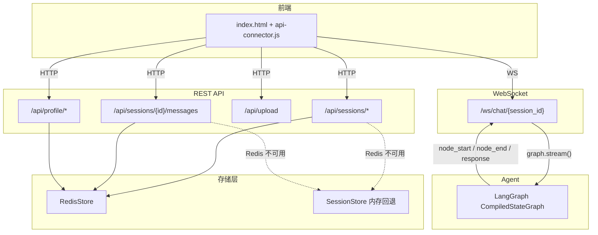
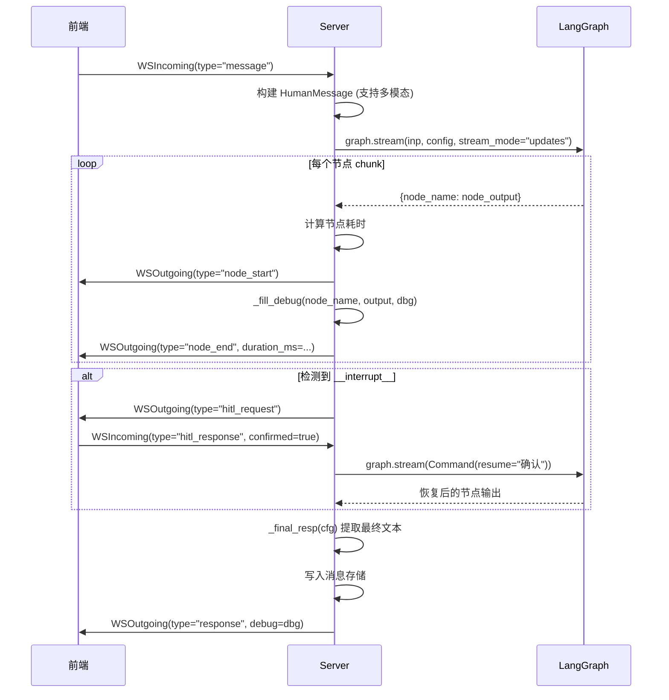

# server — Web 服务

FastAPI 后端，提供 REST API 和 WebSocket 两种接口。REST 处理会话管理、用户画像、文件上传等 CRUD 操作；WebSocket 处理实时对话，逐节点推送 Agent 执行事件。

## 模块总览

```
server/
├── __init__.py          # 包标识
├── app.py               # FastAPI 主应用（REST + WebSocket + 启动/关闭）
├── models.py            # Pydantic 请求/响应模型
├── redis_store.py       # Redis 统一存储（用户画像 + 会话管理）
└── session_store.py     # 内存回退存储（开发环境）
```

## 数据流



## app.py — 主应用

### 启动流程（lifespan）

```
1. 初始化存储层：优先 RedisStore，失败回退 SessionStore
2. 初始化 Agent：
   - DEMO_MODE=true → 跳过，使用预设模拟数据
   - 正常模式 → initialize_agent(profile_manager=RedisStore or None)
3. 确保有默认会话（首次启动时创建）
```

### REST API

| 方法 | 路径 | 说明 |
|---|---|---|
| GET | `/api/sessions?user_id=` | 列出用户的所有会话 |
| POST | `/api/sessions` | 创建会话 |
| DELETE | `/api/sessions/{id}` | 删除会话（自动创建新会话兜底） |
| GET | `/api/sessions/{id}/messages` | 获取会话消息列表 |
| DELETE | `/api/sessions/{id}/messages` | 清空消息 |
| POST | `/api/upload` | 上传文件（图片/音频），返回本地路径和公开 URL |
| GET | `/api/profile/{user_id}` | 获取用户画像 |
| GET | `/api/health/{user_id}` | 健康概览（当前为固定数据） |
| GET | `/api/reminders/{user_id}` | 提醒列表（当前为固定数据） |

文件上传存储到 `server_data/upload/{user_id}/{session_id}/`，删除会话时联动清理。

### WebSocket 协议

连接路径：`/ws/chat/{session_id}`

**客户端 → 服务端 (`WSIncoming`)：**

| type | 字段 | 说明 |
|---|---|---|
| `"message"` | content, modality, image_path, audio_path | 用户消息（支持多模态附件） |
| `"hitl_response"` | confirmed: bool | HITL 确认/取消 |

**服务端 → 客户端 (`WSOutgoing`)：**

| type | 字段 | 说明 |
|---|---|---|
| `"node_start"` | node, event_seq, group_id | Agent 节点开始执行 |
| `"node_end"` | node, data, duration_ms, event_seq, group_id | 节点完成 + 耗时 + 输出数据 |
| `"hitl_request"` | data: {message, tool_name, risk_level} | 请求用户确认 |
| `"response"` | content, debug | 最终回复 + 完整 debug 数据 |
| `"error"` | message | 错误信息 |

### Agent 调用流程 (`_agent_response`)



### 节点耗时计算 (`_stream_with_timing`)

同步执行 `graph.stream()`，用 `time.perf_counter()` 记录每两个 chunk 之间的间隔作为节点耗时。同一个 chunk 包含多个节点时均分耗时。

### Debug 数据构建 (`_fill_debug`)

从各节点的输出中提取前端调试面板需要的数据：

| 节点 | 提取的字段 | 写入 debug 的位置 |
|---|---|---|
| perception_router | image_context, audio_context, emotion, modality | `debug.perception` |
| supervisor | pending_intents, current_agent | `debug.intents` |
| medical_agent | rag_context, rag_query_rewrite, hallucination_score, linked_entities | `debug.rag`, `debug.entities` |
| device_agent | tool_calls, tool_results | `debug.tools` |

### 并行分组 (`group_id`)

用于前端 Pipeline 动画的排序：

| group_id 前缀 | 含义 | 包含的节点 |
|---|---|---|
| `"0-serial"` | 串行段 | perception_router, supervisor |
| `"1-parallel"` | 并行段 | medical_agent, device_agent, chat_agent（并行时） |
| `"2-post"` | 收尾段 | response_synthesizer, output_guard, memory_writer |

### Demo 模式

`DEMO_MODE=true` 时不初始化 Agent，返回预设的模拟数据。内置三个 demo 场景（medical/compound/device），前端可通过顶部按钮触发。

## models.py — 数据模型

| 模型 | 用途 |
|---|---|
| `SessionMeta` | 会话元数据（id, name, created_at, updated_at, message_count, user_id） |
| `SessionCreate` | 创建会话请求（name, user_id） |
| `MessageRecord` | 单条消息（role, content, timestamp, sources, metadata） |
| `WSIncoming` | WebSocket 客户端消息 |
| `WSOutgoing` | WebSocket 服务端消息 |
| `HealthOverview` | 健康概览（血压、血糖、提醒统计） |
| `ReminderItem` | 单条提醒（time, message, repeat, active, done） |

## redis_store.py — Redis 统一存储

同时实现 `ProfileManagerProtocol`（用户画像）和会话管理接口，替代原有的 SQLite + 内存存储。

### Redis Key 结构

| Key 模式 | 类型 | 说明 |
|---|---|---|
| `profile:{user_id}` | String (JSON) | 用户画像 |
| `session:{session_id}:meta` | String (JSON) | 会话元数据 |
| `session:{session_id}:messages` | List | 消息列表（每项 JSON） |
| `user_sessions:{user_id}` | Sorted Set | 用户的会话索引（score=updated_at） |

### 会话管理方法

| 方法 | 说明 |
|---|---|
| `create_session(name, user_id)` | 创建会话 + 添加欢迎消息 + 加入用户索引 |
| `get_session(session_id)` | 获取元数据 |
| `list_sessions(user_id)` | 按 updated_at 倒序列出（zrevrange） |
| `delete_session(session_id)` | pipeline 删除 meta + messages + 索引 |
| `add_message(session_id, message)` | rpush 消息 + 更新 meta + 更新索引 score |
| `get_messages(session_id)` | lrange 获取全部 |

会话首条用户消息自动成为会话名（取前 15 字符）。

所有 session 相关 Key 设置 TTL（默认 30 天，`config.SESSION_TTL_SECONDS`），过期后自动清理。

### 用户画像方法

与 `UserProfileManager` (SQLite) 接口完全对齐：

| 方法 | 说明 |
|---|---|
| `get_profile(user_id)` | 获取画像，不存在则创建默认 |
| `update_profile(user_id, updates)` | 增量更新（list 合并、dict 深度合并） |
| `delete_profile(user_id)` | 删除画像 |

合并逻辑与 `UserProfileManager` 相同：列表去重追加，字典递归合并，类型不匹配跳过。

## session_store.py — 内存回退

接口与 `RedisStore` 对齐，数据存储在 Python dict 中。Redis 不可用时自动切换到此实现。

进程重启后数据丢失，仅用于开发环境。
