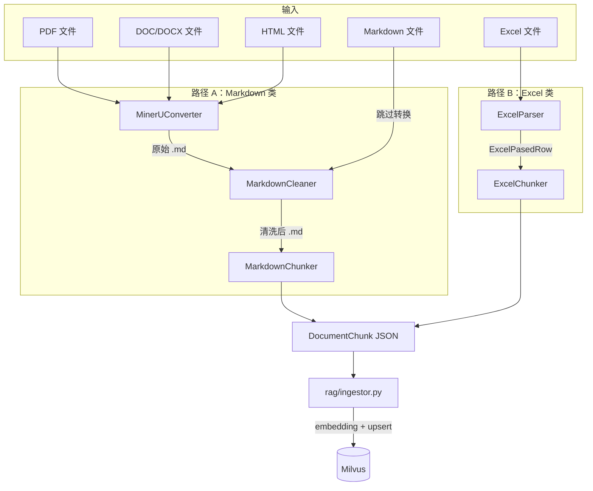

# tools/document — 文档处理工具

将 PDF、Excel、HTML、Markdown 等原始文档转换为可入库的结构化 chunk。整个流程分三步：格式转换 → 清洗 → 切片。处理完的 chunk 以 JSON 格式输出，供下游 `rag/ingestor.py` 向量化后写入 Milvus。

## 模块总览

```
tools/document/
├── __init__.py                     # 延迟导入
├── markdown_convert_pipeline.py    # 统一流水线：MinerU 转换 + Markdown 清洗
├── core/
│   └── pipeline_base.py            # 抽象接口 BaseDocumentPipeline
├── converter/
│   └── mineru_converter.py         # MinerU API 封装（PDF/HTML → Markdown）
├── cleaner/
│   └── md_cleaner.py               # Markdown 深度清洗器
└── parser/
    └── excel_parser.py             # Excel 行级解析器（自动列角色推断）
```

## 数据流

两条处理路径，按文件类型分流：



`UnifiedChunker`（位于 `rag/chunker/unified_chunker.py`）是对外的统一入口，自动识别文件类型并选择对应路径。本目录下的模块只负责"转换"和"清洗"两步，"切片"由 `rag/chunker/` 完成。

## 各文件说明

### core/pipeline_base.py

定义 `BaseDocumentPipeline` 抽象类，只有一个方法：

```python
def process(self, file_paths: list[Path], output_dir: Path) -> list[Path]
```

`MarkdownConverter` 实现了这个接口。

### converter/mineru_converter.py

通过 MinerU 云端 API 将 PDF/HTML/DOC 转为 Markdown。整个过程是异步的：先上传文件拿到 batch_id，然后轮询等待提取完成，最后下载 zip 包并从中提取 .md 文件。

**类：`MinerUConverter`**

| 方法 | 说明 |
|---|---|
| `process(file_paths, output_dir, ...)` | 一站式流程：上传 → 轮询 → 下载 |
| `apply_upload_urls(files, model_version)` | 向 MinerU 申请预签名上传 URL |
| `upload_files(file_paths, upload_urls)` | PUT 上传本地文件到预签名 URL |
| `get_extract_results(batch_id)` | 查询提取状态 |
| `wait_for_completion(batch_id, ...)` | 轮询等待，默认 20 秒间隔，600 秒超时 |
| `download_results(extract_response, output_dir)` | 下载 zip 并提取 .md 文件 |

`process()` 内部调用顺序：

```
apply_upload_urls → upload_files → wait_for_completion → download_results
```

支持两种模型版本：
- `"vlm"` — 用于 PDF/DOC/DOCX（默认）
- `"MinerU-HTML"` — 用于 HTML 文件

异常类层级：

```
MinerUError
├── MinerUUploadError      # 上传阶段
├── MinerUExtractError     # 提取阶段（含有文件失败）
├── MinerUDownloadError    # 下载/解压阶段
└── MinerUTimeoutError     # 轮询超时
```

**数据模型：**

| 类 | 用途 |
|---|---|
| `MinerUFileRequest` | 上传请求参数（文件名、是否 OCR） |
| `MinerUUploadResponse` | 上传响应（batch_id + 预签名 URL 列表） |
| `MinerUExtractResult` | 单文件提取状态（state: done/running/failed + zip URL） |
| `MinerUExtractResponse` | 批次级提取状态 |
| `MinerUExtractProgress` | 提取进度（已提取页数/总页数） |

### cleaner/md_cleaner.py

Markdown 深度清洗器。MinerU 输出的原始 Markdown 包含大量 PDF 残留噪音（页码、页眉页脚、目录导引符、引用标记等），需要清洗后才能切片。

**类：`MarkdownCleaner`**

| 方法 | 输入 | 输出 |
|---|---|---|
| `clean_text(text)` | 原始 Markdown 字符串 | 清洗后的 Markdown（带 YAML frontmatter） |
| `clean_file(file_path, output_path)` | 文件路径 | 清洗后的文件路径 |
| `clean(file_paths, output_dir)` | 文件列表 | 清洗后的文件列表 |

`clean_text()` 内部处理流程（按执行顺序）：

```
 1. extract_frontmatter      提取文档标题（首个 H1 或 YAML title）
 2. normalize_text           统一换行符，清除控制字符
 3. linearize_tables         Markdown 表格 → "字段: 值" 线性化文本
 4. protect_blocks           用占位符保护代码块和公式块
 5. clean_html_content       清洗 HTML 标签（img/a/table/通用标签/实体）
 6. clean_images_and_links   Markdown 格式的图片和链接
 7. remove_references        参考文献区域（双重判定：序号前缀 + 文献类型标识）
 8. remove_citations         LaTeX / HTML / 普通引用标记
 9. remove_toc               目录区域
10. remove_page_noises       独立页码行
11. remove_redundant_headers 全文高频重复短行（页眉/页脚）
12. remove_inline_noises     行内页码后缀
13. filter_garbage           纯符号行
14. format_headers           中文章节标题添加 Markdown 级别前缀
15. normalize_heading_levels 按编号层级重新分配标题级别
16. smart_merge_paragraphs   被错误断行的段落智能合并
17. restore_blocks           还原代码块和公式块
18. 组装 YAML frontmatter + 清洗后正文
```

**`CleanOptions`** 控制各步骤的开关：

| 选项 | 默认 | 说明 |
|---|---|---|
| `remove_images` | True | 图片标记替换为 [图片略] |
| `remove_links` | True | 超链接简化为纯文本 |
| `remove_citations` | True | LaTeX/HTML/普通引用标记 |
| `remove_toc` | True | 目录区域 |
| `remove_page_noise` | True | 独立页码行 |
| `remove_redundant_headers` | True | 高频重复短行 |
| `remove_inline_noise` | True | 行内页码后缀 |
| `remove_references` | True | 参考文献段落 |
| `linearize_tables` | True | Markdown 表格线性化 |
| `format_headers` | True | 中文标题添加 # 前缀 |
| `merge_paragraphs` | True | 智能段落合并 |
| `clean_html_tags` | True | HTML 标签清洗 |

**`CleanStats`** 记录各步骤的处理数量，清洗完成后通过日志输出。

HTML 表格线性化支持 rowspan/colspan 合并单元格的完整展开：解析 `<tr>`/`<th>`/`<td>` → 构建二维网格 → 识别表头结构 → 生成"字段: 值"格式。

### parser/excel_parser.py

Excel 行级解析器，支持手动配置和自动推断两种列角色分配方式。

**列角色枚举：`ColumnRole`**

| 值 | 说明 | 处理方式 |
|---|---|---|
| `METADATA` | ID、名称、分类等短文本 | 不参与 Embedding，附加到 chunk 作为过滤/溯源信息 |
| `CONTENT` | 适应症、不良反应等长文本 | 构建为 chunk 并 Embedding |
| `SKIP` | 空列、无意义列 | 忽略 |

**自动推断规则（`ColumnAnalyzer`）：**

```
填充率 < 30%                         → SKIP
平均长度 > 80 字符                    → CONTENT
平均长度 < 30 且唯一值 < 20           → METADATA（枚举/标签）
唯一值占比 > 90% 且平均长度 < 50      → METADATA（ID 类）
其余                                  → METADATA（默认保守策略）
```

手动配置优先级高于自动推断。项目内置了药品说明书的预定义配置 `DRUG_CONFIG`：

```python
DRUG_CONFIG = ColumnConfig(
    skip=["r3", "标题链接"],
    metadata=["标题", "编号", "通用名称", "批准文号", "药品分类", "生产企业", ...],
    content=["适应症", "不良反应", "用法用量", "禁忌", "注意事项", ...],
    context_prefix_field="通用名称",
)
```

**类：`ExcelParser`**

| 方法 | 输入 | 输出 |
|---|---|---|
| `parse(file_path, sheet_name=None)` | Excel 文件路径 | `Iterator[ExcelPasedRow]` |
| `get_column_analysis_report(file_path)` | Excel 文件路径 | 可打印的列分析报告 |

`parse()` 处理流程：

```
读取 Excel（支持多 sheet） → 推断列角色 → 逐行分离 metadata / content → yield ExcelPasedRow
```

**数据结构：`ExcelPasedRow`**

| 字段 | 类型 | 说明 |
|---|---|---|
| `metadata` | `dict[str, Any]` | 元数据键值对 |
| `contents` | `dict[str, str]` | 内容键值对（列名 → 文本） |
| `source_file` | `str` | 来源文件路径 |

ExcelPasedRow 不做切片，直接交给 `rag/chunker/excel_chunker.py` 按主题分组合并为 DocumentChunk。

### markdown_convert_pipeline.py

将 MinerUConverter 和 MarkdownCleaner 串联为一条流水线。

**类：`MarkdownConverter`**（实现 `BaseDocumentPipeline`）

| 方法 | 输入 | 输出 |
|---|---|---|
| `process(file_paths, output_dir, ...)` | 文件路径列表 + 输出目录 | 清洗后的 .md 文件路径列表 |

内部流程：

```
file_paths → MinerUConverter.process() → 原始 .md 文件（临时目录）
          → MarkdownCleaner.clean() → 清洗后 .md 文件（输出目录）
```

临时目录用 `tempfile.TemporaryDirectory` 管理，流程结束后自动清理。

## 被谁调用

| 调用方 | 使用的组件 | 场景 |
|---|---|---|
| `rag/chunker/unified_chunker.py` | MarkdownConverter, MarkdownCleaner, ExcelParser | 按文件类型自动分发处理 |
| 数据入库脚本 | UnifiedChunker（间接调用本目录模块） | 批量文档处理 |
